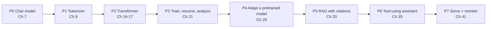

## Capstone Map

[Back to index](../../README.md)

Seven cumulative capstones, plus a warm-up project. Each capstone uses code from the previous ones. Every capstone chapter provides: the problem and success criteria, required prior chapters, hardware and dependency requirements, a complete implementation, evaluation and failure cases, a debugging exercise, a reviewer checklist, and extensions that require your own decisions.

| # | Project | Chapter | Requires chapters | Hardware | Key success criteria (summary) | Code |
|---|---|---|---|---|---|---|
| P0 | Next-character predictor (warm-up) | 7 | 1–6 | CPU, minutes | Validation loss beats the "always guess the most common character" baseline; single batch can be overfit; checkpoint round-trips | `code/llmfp/char_model.py` |
| P1 | Build and test a tokenizer | 9 | 2, 8 | CPU | Byte-level BPE; exact round trip on arbitrary Unicode, including emoji and code; save/load; tests; compression compared with a published tokenizer | `code/projects/p1_tokenizer/` |
| P2 | Small decoder-only transformer from scratch | 16–17 | 10–15 | CPU | Shape, causality, mask, and gradient-flow tests pass; parameter count matches hand count; KV-cached generation matches uncached output | `code/projects/p2_transformer/` |
| P3 | Train, resume, analyze limitations | 21 | 18–20 | CPU (hours) or GPU (minutes) | Reproducible data pipeline; validation loss below agreed target; interrupted run resumes to the same result; written limitations analysis with examples | `code/projects/p3_train_and_analyze/` |
| P4 | Adapt a pretrained model to a narrow task | 28 | 22–27 | CPU for small LoRA; GPU for QLoRA | Baseline measured first; adapted model beats prompting baseline on a held-out set; forgetting check on a general set | `code/projects/p4_adapt/` |
| P5 | RAG application with citations + eval suite | 33 | 30–32 | CPU | Retrieval evaluated separately; every factual claim cited; refuses unanswerable questions; eval suite runs in one command | `code/projects/p5_rag/` |
| P6 | Constrained tool-using assistant | 35 | 31, 34, 36 | CPU | Tools validated against schemas; allowlist and approval gate enforced in code, not prompts; step, time, and cost limits; injection tests pass | `code/projects/p6_tool_assistant/` |
| P7 | Serve an LLM application with monitoring and regression checks | 41 | 37–40 | CPU | Streaming HTTP API with timeouts, cancellation, queue limits; traces and privacy-conscious logs; regression suite gates deployment; rollback demonstrated | `code/projects/p7_serve/` |

### How capstones connect to the harbor example

- P1 trains first on harbor text, then on the Part 4 dataset.
- P2 and P3 use the Part 4 dataset; harbor text is the fast smoke test.
- P4 adapts a small pretrained instruction model to a narrow harbor task: turning free-text harbor log entries into structured records. The exact task is fixed in Chapter 25.
- P5 answers questions over the original *Harbor Handbook*.
- P6 adds tools (tide table lookup, boat log search, a log-entry writer that requires approval).
- P7 serves the combined "Harbor Desk" application.
