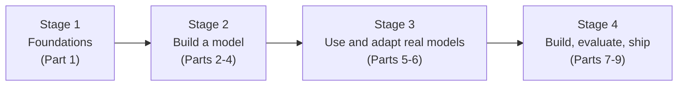

## The Learning Journey

[Back to index](../../README.md)

### Who this is for

You can write ordinary programs: loops, functions, maybe a class or two. You may have used a chatbot or an LLM API. You do not have a reliable background in machine learning, and you have noticed that many tutorials say "now we apply layer normalization" as if the phrase explained itself.

This book treats you as a capable engineer who has not yet been given the missing pieces.

### The shape of the journey

The book moves in four broad stages. Each stage produces working software you keep using in the next.

**Stage 1: Foundations (Part 1, Chapters 1–7).** You build a language model that works by counting, before any neural network appears. That gives you a concrete reference for words like *parameter*, *training*, *inference*, and *checkpoint*. You then set up a reproducible Python environment, learn tensors (the arrays every model is made of), learn how a neural network is trained without any calculus, and train your first small network: a next-character predictor for the same text the counting model used.

**Stage 2: Build a language model from scratch (Parts 2–4, Chapters 8–21).** You write a tokenizer, then every component of a GPT-style transformer in plain PyTorch: embeddings, attention, the transformer block, the output head, generation, and a key-value cache. You train the model on a licensed dataset, learn to read loss curves, resume from checkpoints, debug failed runs, and compare decoding strategies. You finish knowing exactly what a tiny model trained on modest hardware can and cannot do.

**Stage 3: Use and adapt real models (Parts 5–6, Chapters 22–29).** You load published GPT-2 weights into *your own* model code and confirm it produces the same outputs as the reference implementation. Only then do you switch to established libraries, so the library is a convenience rather than a mystery. You choose models by measurement, quantize them, and adapt them with classification fine-tuning, instruction tuning, and LoRA. Preference tuning gets a clear conceptual treatment and a small runnable experiment.

**Stage 4: Build, evaluate, and ship (Parts 7–9, Chapters 30–45).** You build applications around models: structured outputs, retrieval-augmented generation (RAG) with citations, and a tool-using assistant with permissions and approval gates. You learn to evaluate these systems honestly, to serve them with streaming, timeouts, and monitoring, and to reason about cost, privacy, and security. The final part orients you to advanced topics and to professional habits: reading papers, reproducing results, and judging claims.

### The recurring example: the harbor

Small, controlled examples make cause and effect visible. The book returns again and again to one setting, a small fishing harbor with a lighthouse:

- **Chapter 1** trains a counting model on 40 sentences about the harbor ([`code/data/tiny/harbor.txt`](../../code/data/tiny/harbor.txt)).
- **Chapter 7** trains a neural next-character model on the same text, so you can compare the two directly.
- **Chapter 9** trains a tokenizer, first on harbor text and then on a larger corpus.
- **Parts 3–4** move to a larger licensed dataset, because 40 sentences cannot teach a transformer much. The harbor text stays as a quick smoke test.
- **Part 7** builds a "Harbor Desk" assistant: RAG over an original *Harbor Handbook* written for this book, so licensing and ground truth are fully under our control, plus tools for tide tables and the boat log.
- **Part 8** serves Harbor Desk with monitoring and regression checks.

Because we write the harbor material ourselves, we know every fact in it. That makes it possible to test whether a system's answer is correct, which is much harder with text scraped from the internet.

### How competence is built here

Each chapter follows the same rhythm, adjusted to what the topic needs: a concrete problem, the concepts needed to solve it (each explained before use), runnable code, observed output, common mistakes, exercises, and a checkpoint describing what you can now do on your own.

Seven capstone projects (see the [capstone map](capstone-map.md)) bundle the skills into larger pieces of work with success criteria, debugging exercises, and reviewer checklists. A [skills rubric](table-of-contents.md#appendix-f-practical-skills-rubric) lets you assess yourself honestly at the end.

### What this book will not do

- Teach the mathematics of deep learning. Where theory matters for a deeper understanding, the text says so plainly and teaches the practical understanding available without it.
- Train a model that competes with commercial models. That requires data, hardware, and budgets far beyond a single developer. You will learn what changes at scale and why.
- Replace legal advice on licenses, privacy, or copyright. Those sections describe the questions to ask, not definitive answers.
