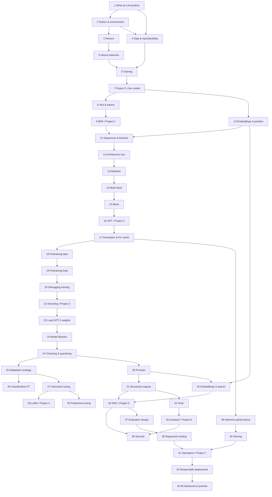

## Prerequisite Map

[Back to index](../../README.md)

This map shows where each foundational concept is **first explained** and where it is **first relied on**. The rule: no chapter uses a concept before the chapter listed in the "first explained" column. The [editorial ledger](editorial-ledger.md) tracks whether each entry has been delivered.

### Chapter dependency graph

An arrow from A to B means "read A before B". Parts 7–9 depend on everything in Parts 1–5 implicitly; only the direct links are drawn.

### Concept introduction table

"First explained" is the section that defines the concept from scratch. "First relied on" is the first place the text assumes you know it. Concepts previewed informally earlier are noted.

| Concept | First explained | First relied on | Notes |
|---|---|---|---|
| AI, machine learning, deep learning, NLP | 1.2 | 1.3 | |
| Language model, LLM | 1.2, 1.6 | 1.6 | |
| Model, architecture | 1.4 | 1.8 | Counting model is the concrete example |
| Parameter, weight | 1.4 | 1.10 | Count table = parameters; neural weights in 5.3 |
| Hyperparameter | 1.4 | 1.11 | `context_size` is the first example |
| Checkpoint | 1.4 | 1.10 | Full training checkpoints (optimizer state) in 19.9 |
| Training, inference | 1.5 | 1.8 | |
| Pretraining, fine-tuning, adaptation | 1.5 | Part 6 | Revisited in 25.2 |
| Token (informal: a word or punctuation mark) | 1.6 | 1.8 | Formal definition in 8.6 |
| Context, context size | 1.6 | 1.8 | Context window/length formalized in 11.2 |
| Next-token prediction; candidates with scores | 1.6 | 1.7 | Scores → logits in 5.7 |
| Autoregressive generation | 1.7 | 1.8 | |
| Greedy vs sampled choice (informal) | 1.7 | 1.10 | Full treatment in Chapter 21 |
| Special tokens (start/end markers) | 1.8 | 1.9 | Formalized in 9.6 |
| Vocabulary (informal) | 1.10 | 1.10 | Formalized in 8.6 |
| Memorization vs generalization (informal) | 1.11 | 4.5 | Overfitting formalized in 4.5 |
| Random seed (informal) | 1.10 | 1.10 | Full treatment in 4.6 |
| Virtual environment, package, pinned dependency | 2.2 | 2.3 | Ch 1 needs only the standard library |
| Iterator, generator | 2.7 | 11.8 | |
| Dataclass, `__call__` | 2.4, 2.6 | 5.5 | |
| Tensor, shape, dimension, axis | 3.3 | 3.5 | |
| Data type (dtype) | 3.4 | 3.12 | Mixed precision in 19.10; quantization in 24.4 |
| Broadcasting | 3.7 | 5.3 | |
| Batch, batch dimension | 3.9 | 5.8 | Sequence batches in 11.5 |
| Device, CPU, GPU, RAM, VRAM | 3.11 | 7.5 | |
| Dataset, example, label | 4.2 | 4.3 | |
| Train/validation/test split | 4.3 | 4.5 | |
| Leakage | 4.4 | 18.6 | Contamination in 18.6, 37.4 |
| Overfitting, underfitting | 4.5 | 6.10 | |
| Configuration, experiment record | 4.7, 4.8 | 7.5 | |
| Neuron/unit, linear layer | 5.2, 5.3 | 5.4 | |
| Activation function | 5.4 | 5.5 | Specific choices (GELU, SwiGLU) in 15.2 |
| Forward pass | 5.5 | 6.7 | |
| Logits | 5.7 | 6.2 | |
| Softmax (by behavior) | 5.7 | 6.2 | |
| Loss, cross-entropy (by behavior) | 6.2 | 6.7 | Interpreting values in 19.3 |
| Gradient | 6.4 | 6.5 | |
| Backward pass, automatic differentiation | 6.5 | 6.7 | |
| Optimizer, learning rate | 6.6 | 6.7 | Schedules in 19.6 |
| Training loop | 6.7 | 7.5 | |
| Gradient accumulation (intentional vs accidental) | 6.8 | 19.8 | |
| `train()` / `eval()`, `no_grad` | 6.9 | 7.5 | Dropout's dependence on mode shown in 15.6 |
| One-hot encoding | 7.4 | 7.5 | |
| `state_dict` | 7.8 | 16.10 | |
| Overfitting a single batch (debugging) | 7.9 | 20.3 | |
| Unicode, code point, UTF-8, byte | 8.2, 8.3 | 8.7 | |
| Token, vocabulary, token ID (formal) | 8.6 | 8.7 | |
| Byte-pair encoding, merges | 9.2 | 9.4 | |
| Unknown token | 9.6 | 9.6 | |
| Embedding, embedding table, vector | 10.3, 10.4 | 10.5 | |
| Cosine similarity (by behavior) | 10.4 | 32.5 | |
| Positional embedding | 10.7 | 12.6 | RoPE in 15.7 |
| Input/target shift | 11.3 | 11.9 | |
| Padding, masks, ignore index | 11.6 | 13.7 | |
| Packing | 11.7 | 27.6 | |
| Encoder / decoder | 12.4 | 12.5 | |
| Attention, self-attention | 13.2, 13.3 | 13.4 | |
| Query, key, value | 13.4 | 13.5 | |
| Attention scores, attention weights | 13.5 | 13.6 | |
| Causal mask | 13.6 | 13.8 | |
| Multi-head attention | 14.2 | 15.8 | |
| Feed-forward layer | 15.2 | 15.8 | |
| Residual connection | 15.3 | 15.8 | |
| Normalization (LayerNorm, RMSNorm) | 15.4 | 15.8 | |
| Dropout | 15.6 | 15.8 | |
| RoPE | 15.7 | 15.8 | |
| Output head, weight tying, initialization | 16.2, 16.5, 16.4 | 16.7 | |
| KV cache | 17.5 | 39.4 | |
| Dataset card, license, provenance | 18.2 | 22.6 | Model licenses in 22.6, 23.7 |
| Deduplication, contamination | 18.5, 18.6 | 37.4 | |
| AdamW, weight decay | 19.5 | 19.11 | |
| Warmup, learning-rate schedule | 19.6 | 19.11 | |
| Gradient clipping | 19.7 | 19.11 | |
| Mixed precision | 19.10 | 24.4 | |
| Temperature, top-k, top-p | 21.4, 21.5 | 23.6 | |
| Model card, config file | 22.2 | 23.2 | |
| Safetensors | 22.3 | 23.3 | |
| Base / instruction / chat model | 23.4 | 23.5 | |
| Chat template | 23.5 | 27.4 | |
| Quantization | 24.4 | 28.5 | |
| Fine-tuning (full) | 26.2, 27.7 | 28.1 | |
| Loss masking | 27.5 | 28.3 | |
| Catastrophic forgetting | 27.8 | 28.8 | |
| LoRA, QLoRA | 28.2, 28.5 | 28.9 | |
| RLHF, reward model, PPO, DPO | 29.3–29.6 | 29.7 | |
| Instruction hierarchy, few-shot | 30.2, 30.3 | 31.4 | |
| Schema validation | 31.2 | 34.3 | |
| Embedding model | 32.2 | 33.3 | |
| Chunking, vector store, reranking | 32.4–32.6 | 33.3 | |
| RAG | 33.3 | 36.3 | |
| Tool calling | 34.2 | 35.1 | |
| Workflow vs agent | 34.4 | 35.1 | |
| Prompt injection | 36.2 | 38.2 | Mentioned as a risk in 33.7, 35.2 with forward link |
| Baseline, human eval, model judge | 37.3, 37.5, 37.6 | 38.5 | |
| Hallucination | 21.9 (informal), 38.3 | 33.7 | First named informally in 1.12 |
| Latency, TTFT, throughput | 39.2 | 40.6 | |
| Backpressure | 40.5 | 41.4 | |
| Tracing | 41.2 | 41.4 | |

### Unresolved dependencies

None at present. Chapter 1 mentions neural networks, attention, embeddings, and tokens only as named signposts in 1.13, each with a forward link and without relying on them.
