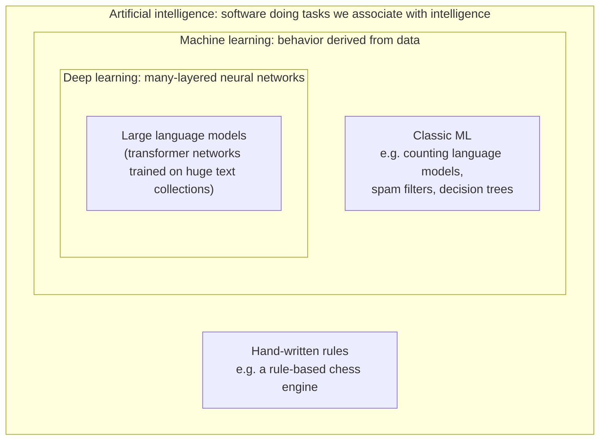
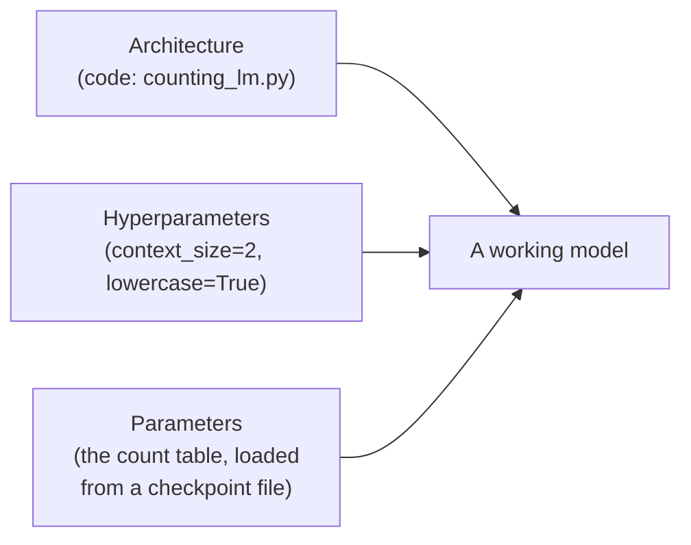
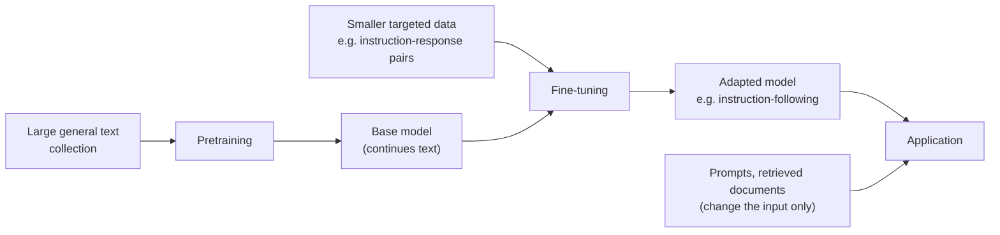
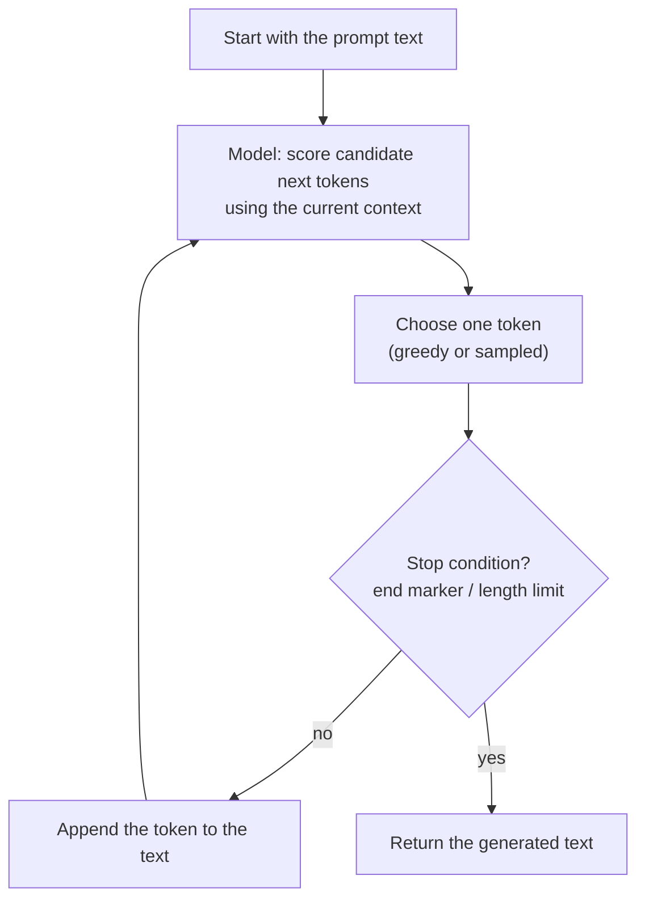
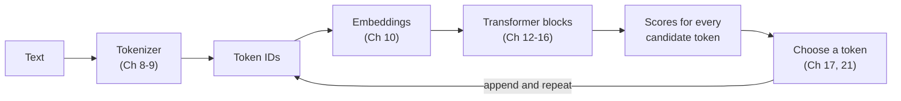

## Chapter 1: What a Language Model Is and What It Predicts

[Back to index](../../README.md) · Next: Chapter 2 (planned)

You type a question into a chatbot, and an answer appears a few words at a time. Before you can build, adapt, or debug a system like that, you need a precise picture of what the underlying model actually does. That picture is smaller and more mechanical than the marketing suggests, and more surprising than skeptics allow.

This chapter builds that picture with a working language model you write yourself. It uses only plain Python, and it works by counting. It is not how modern large language models work inside, but it has the same inputs, the same outputs, and the same life cycle. Every term you learn here (*parameter*, *training*, *inference*, *checkpoint*, *context*, *generation*) carries over unchanged to the GPT-style model you build in Part 3.

#### Learning outcomes

By the end of this chapter you will be able to:

1. Explain how AI, machine learning, deep learning, natural language processing, language models, and large language models relate to each other.
2. Distinguish a model's architecture, parameters, hyperparameters, and checkpoint, and point to each one in real code.
3. Describe training, inference, pretraining, fine-tuning, and adaptation, and say which ones change a model's parameters.
4. State exactly what a language model outputs, and explain how a generation loop turns that output into text.
5. Implement, test, save, reload, and run a counting language model.
6. Run controlled experiments that show forgetting, repetition, and memorization, and connect each to a problem later chapters solve.
7. Explain why next-token prediction can produce useful behavior, and what that usefulness does *not* prove.

#### Prerequisites

- You can write and run a Python program from a terminal: variables, `if`, `for`, functions, lists, and dictionaries.
- Python 3.10 or newer installed. Check with `python3 --version` (on Windows, `py --version`). Chapter 2 sets up a proper environment; this chapter needs only Python's standard library, nothing to install.
- No machine-learning background is assumed.

#### New terms in this chapter

Each term is explained properly in the section listed. This table is for quick reference when you return later.

| Term | Plain-English meaning | Section |
|---|---|---|
| Artificial intelligence (AI) | The broad field of making software perform tasks we associate with intelligence | 1.2 |
| Machine learning (ML) | Getting behavior from examples (data) instead of hand-written rules | 1.2 |
| Deep learning | Machine learning that uses neural networks with many layers | 1.2 |
| Natural language processing (NLP) | Software that works with human language | 1.2 |
| Language model | Software that, given some text, scores what could come next | 1.2, 1.6 |
| Large language model (LLM) | A language model built as a very large neural network trained on very large amounts of text | 1.2 |
| Model | An architecture plus the parameter values it uses | 1.4 |
| Architecture | The fixed procedure, written in code, that turns inputs into outputs | 1.4 |
| Parameter (weight) | A stored number the architecture uses, set by training | 1.4 |
| Hyperparameter | A setting chosen by a person before training, which training does not change | 1.4 |
| Checkpoint | A saved file of a model's parameters (and settings), so it can be reloaded later | 1.4 |
| Training | The process that sets parameters from data | 1.5 |
| Inference | Using a model with fixed parameters to produce outputs | 1.5 |
| Pretraining | The first, broad training phase on large amounts of general text | 1.5 |
| Fine-tuning | Further training on smaller, targeted data to change behavior | 1.5 |
| Adaptation | Any technique that makes a pretrained model serve a specific purpose | 1.5 |
| Token | The unit of text a model reads and predicts; in this chapter, a word or punctuation mark | 1.6 |
| Context | The part of the input text the model uses to make its prediction | 1.6 |
| Generation (autoregressive) | Producing text by repeatedly predicting one token, appending it, and predicting again | 1.7 |
| Greedy choice / sampling | Always taking the top-ranked candidate / choosing at random, favoring higher-ranked ones | 1.7 |
| Special token | A marker added to text by the software, such as "start of sentence" or "end of sentence" | 1.8 |

---

### 1.1 The problem: what happens when a chatbot replies?

Suppose you ask a chatbot: *"Write one sentence about a lighthouse keeper."* A reply appears, a word or two at a time, and reads naturally. Ask again and you may get a different sentence. Ask a factual question and you may get a confident, fluent, wrong answer.

As an engineer, you should have questions:

- Is the answer looked up somewhere, assembled from rules, or produced some other way?
- Why does it appear piece by piece instead of all at once?
- Why can the same question produce different answers?
- Why can a fluent answer be false, and why does the system not notice?
- What exactly is the "model" that people download, fine-tune, and deploy? Is it code, data, or both?

Most explanations answer these with metaphors ("it learned language", "it predicts words"). Metaphors are a poor basis for engineering decisions. In this chapter you will build a small system that shows *every one* of the behaviors above, and you will be able to point at the exact line of code responsible for each one. The system is far simpler than an LLM, and section 1.13 is explicit about what differs. But the questions above have the same answers for both.

---

### 1.2 The family tree: AI, machine learning, deep learning, NLP, language models, LLMs

These terms are often used interchangeably in the news. They are not interchangeable, and confusing them leads to confused decisions, such as reaching for an LLM when a few rules or a small classifier would be cheaper and more reliable.

**Artificial intelligence (AI)** is the broadest term: the field concerned with making software perform tasks that we associate with intelligence, such as playing games, recognizing speech, planning routes, or answering questions. AI says nothing about *how*. A chess program built entirely from rules that a programmer wrote by hand is AI.

**Machine learning (ML)** is a part of AI in which the software's behavior is derived from examples, called *data*, rather than written by hand as rules. A machine-learning system has some adjustable internal state, and a process uses the data to set that state. Section 1.3 shows the difference in code.

**Deep learning** is a part of machine learning that uses *neural networks*: programs built from many simple, connected number-processing steps arranged in layers, where "deep" refers to having many layers. You will build neural networks starting in Chapter 5. For now, it is enough to know that a neural network is one particular kind of adjustable program, and that it is the kind used by modern LLMs.

**Natural language processing (NLP)** is the field concerned with software that works with human language: translation, search, spelling correction, summarization, question answering, and so on. NLP is defined by its *subject* (language), not its *method*. NLP systems can use hand-written rules, classic machine learning, or deep learning, which is why NLP overlaps all three of the categories above rather than sitting inside one of them.

A **language model** is a piece of software that, given some text, scores what could come next. That is the whole definition, and section 1.6 makes it precise. Note what it does *not* say: nothing about neural networks or size. Language models built by counting word sequences were used for decades in speech recognition, spelling correction, and machine translation, long before neural networks became practical for the job. The model you build in this chapter is one of these.

A **large language model (LLM)** is a language model built as a very large neural network (in practice, almost always a *transformer*, the architecture you build in Part 3) and trained on very large amounts of text. "Large" refers to two things: the number of stored numbers inside the model, which ranges from hundreds of millions to hundreds of billions, and the amount of training text. There is no official size at which a language model becomes "large"; it is a loose convention, not a technical threshold.

The nesting looks like this:



The diagram cannot show NLP neatly, because NLP cuts across all the boxes: a rule-based grammar checker, a counting language model, and an LLM are all NLP. The table makes the relationships explicit:

| Term | Defined by | Example | Relationship |
|---|---|---|---|
| AI | Goal: intelligent-seeming behavior | Route planner, chess engine, chatbot | Contains ML |
| Machine learning | Method: behavior derived from data | Spam filter trained on labeled emails | Part of AI; contains deep learning |
| Deep learning | Method: many-layered neural networks | Image recognizer, LLM | Part of ML |
| NLP | Subject: human language | Spell checker, translator, search engine | Overlaps rules, ML, and deep learning |
| Language model | Task: score what text comes next | This chapter's counting model; GPT-2 | An NLP system; may or may not use deep learning |
| LLM | A language model built as a large neural network and trained on lots of data | GPT-style chat models | A language model built with deep learning |

> **Misconception: "AI" and "LLM" mean the same thing.** LLMs are one recent, prominent kind of AI. Many working AI systems contain no language model at all, and many language tasks are better served by smaller tools. Part 6 (Chapter 25) and Part 7 return to the question of when an LLM is the right tool.

---

### 1.3 Rules versus learned behavior

Here is the difference between hand-written rules and machine learning in code. Suppose you want an autocomplete feature for messages in a harbor office: when someone types "the keeper", suggest the next word.

The rule-based approach: a programmer decides the suggestions.

```python
# Standalone example: run it with python3, or paste it into a Python prompt.
RULES = {
    "the keeper": ["lit", "wrote"],
    "the boats": ["left", "came"],
}

def suggest_by_rules(text: str) -> list[str]:
    return RULES.get(text.lower(), [])

print(suggest_by_rules("The keeper"))   # ['lit', 'wrote']
print(suggest_by_rules("The fishers"))  # []  -- nobody wrote a rule for this
```

The learning approach: the program derives suggestions from example sentences.

```python
# Standalone example: run it with python3, or paste it into a Python prompt.
from collections import Counter

examples = [
    "the keeper lit the lamp",
    "the keeper wrote the log",
    "the keeper lit the stove",
    "the fishers mended the nets",
]

# "Learning": record which word followed each pair of words.
followers: dict[str, Counter] = {}
for sentence in examples:
    words = sentence.split()
    for i in range(len(words) - 2):
        pair = words[i] + " " + words[i + 1]
        followers.setdefault(pair, Counter())[words[i + 2]] += 1

def suggest_by_learning(text: str) -> list[str]:
    counts = followers.get(text.lower(), Counter())
    return [word for word, _ in counts.most_common()]

print(suggest_by_learning("The keeper"))   # ['lit', 'wrote'] -- 'lit' seen twice, so first
print(suggest_by_learning("The fishers"))  # ['mended']
```

Both functions have the same shape: text in, suggestions out. The difference is *where the behavior comes from*. In the first, a person wrote it. In the second, a person wrote a *procedure* (count which word follows which pair), and the data supplied the specifics. Give the second program different sentences and its suggestions change, with no code change.

That is the essential trade of machine learning. You stop writing behavior directly and start writing a procedure plus choosing data. You gain behavior you could never write by hand. You also take on new problems: the behavior is only as good as the data, it can fail on inputs unlike the data, and it is harder to inspect. Those three problems recur through the whole book.

---

### 1.4 What a model is made of: architecture, parameters, weights, hyperparameters, checkpoints

When someone says "I downloaded a model", "the model has 7 billion parameters", or "we changed the learning rate", they are referring to different parts of a system. Keeping them distinct prevents a lot of confusion later.

**Analogy (a teaching device, not how the software works):** think of a sound mixing desk. The *wiring* inside the desk, which determines how signals flow from inputs to outputs, is fixed when the desk is built. The *positions of its knobs* determine what the output actually sounds like. *How many channels the desk has* was decided before anyone touched a knob. A *photo of all the knob positions* lets you restore a setup later. The analogy breaks down in two places: a mixing desk's knobs are set by a person, whereas a model's are set by an automated training process; and a desk's knobs have labels like "bass", whereas most of a neural network's stored numbers have no individual meaning a person can read.

Now the actual terms:

**Architecture.** The fixed procedure that turns an input into an output, written as code. For the counting model you are about to build, the architecture is: *take the last few words of the input, look them up in a table, and rank the words recorded there by how often they were seen.* For an LLM, the architecture is the arrangement of transformer layers you build in Part 3. Two models with the same architecture run the same code.

**Parameters.** The stored numbers the architecture uses, whose values are set by training. For the counting model, the parameters are the counts in the table: "after `the keeper`, the word `wrote` was seen 3 times" is one parameter, with value 3. For a neural network, parameters are numbers that control how strongly each internal connection influences the result. Two models with the same architecture but different parameters behave differently, just as the same code given different data behaves differently.

**Weights.** In practice, "weights" is used as a near-synonym for "parameters" when talking about neural networks ("download the weights", "the weights file"). Chapter 5 shows that neural network parameters come in two kinds, weights and biases, and that people say "weights" loosely for both.

**Hyperparameters.** Settings chosen by a person *before* training, which training itself does not change. They shape the architecture or the training process. For the counting model, there are two: how many previous words to look at (`context_size`) and whether to lowercase the text (`lowercase`). For an LLM, hyperparameters include the number of layers and the learning rate (Chapter 6). The "hyper" prefix means "about the parameters": these settings determine how the parameters are organized or learned.

**Checkpoint.** A saved copy of a model's parameters, together with the settings needed to use them, written to disk so you can reload the model later without retraining. The name comes from long training runs: you save "checkpoints" along the way so a crash does not lose everything. In this chapter, a checkpoint is a JSON file containing the hyperparameters and the count table. Chapter 19 extends checkpoints to include everything needed to *resume training*, not only to use the model.

**Model.** An architecture plus a set of parameter values. Neither part works alone:



- Code without parameters is an *untrained* model: correct procedure, nothing learned.
- A checkpoint without matching code is a file of numbers. Nothing in it says how to use them. This is why loading published weights (Chapter 22) requires code whose architecture matches the one that produced them, down to the names and shapes of every parameter.

When people "download an LLM", they almost always download a checkpoint (parameter files, a configuration file of hyperparameters, and tokenizer files) and run it with code from a library that implements the matching architecture.

| Term | Counting model (this chapter) | GPT-style LLM (Parts 3–5) |
|---|---|---|
| Architecture | Look up last N words in a table; rank followers | Embeddings, transformer blocks, output head |
| Parameters | Counts, e.g. 226 of them on the harbor data | Learned numbers: about 124 million for the smallest GPT-2, billions for larger models |
| Can you read one parameter? | Yes: "`wrote` followed `the keeper` 3 times" | Generally no: one number has no meaning by itself |
| Hyperparameters | `context_size`, `lowercase` | Layer count, context length, learning rate, and many more |
| Checkpoint | A JSON file | One or more large binary files plus a config file |

---

### 1.5 The model life cycle: training, inference, pretraining, fine-tuning, adaptation

**Training** is the process that sets a model's parameters from data. For the counting model, training is counting: read the text, and for every position, add one to the count for "this word followed this context". For a neural network, training is a long loop of small measured adjustments (Chapter 6). Training is usually expensive and done occasionally.

**Inference** is using a model whose parameters are fixed to produce outputs for new inputs. For the counting model, inference is looking up a context and ranking what was recorded. For an LLM, inference is running the network on your prompt. Inference happens every time someone uses the model, so its speed and cost matter for applications (Part 8). During inference, parameters do not change; this is true of LLMs too, and it matters in section 1.12.

For LLMs, training is usually split into phases:

**Pretraining** is the first, broad phase: train on a large amount of general text to predict the next token. The result is called a *base model*. A base model continues text; it does not reliably follow instructions. Ask a base model "What is the capital of France?" and it may continue with another question, as if completing a quiz, because that is a common pattern in text.

**Fine-tuning** is further training of an already-trained model on a smaller, targeted dataset to change its behavior: following instructions (Chapter 27), classifying messages (Chapter 26), or writing in a particular format. Fine-tuning changes parameters, starting from the pretrained values rather than from scratch.

**Adaptation** is the umbrella term this book uses for *any* technique that makes a pretrained model serve a specific purpose. Some adaptation techniques change parameters (fine-tuning, and the cheaper parameter-efficient methods in Chapter 28). Others change only the *input*, leaving parameters untouched: writing better instructions (Chapter 30) or inserting relevant documents into the prompt (retrieval, Chapter 33). Which kind to use is a practical decision with real costs, covered in Chapter 25.



| Activity | Changes parameters? | Typical cost | Book chapters |
|---|---|---|---|
| Pretraining | Yes, from scratch | Highest | 18–21 (at small scale) |
| Fine-tuning | Yes, starting from pretrained values | Moderate | 26–29 |
| Prompting, retrieval | No | Low per change; paid at every inference | 30–33 |
| Inference | No | Paid on every request | 17, 39–41 |

The counting model has a simple analogue of this life cycle. Training it on the harbor sentences is its "pretraining". Training it further on a few extra sentences adds to the existing counts, which is a crude analogue of fine-tuning. Exercise 4 has you try this and discover an important way in which counting differs from neural fine-tuning.

---

### 1.6 What a language model actually predicts

Here is the precise statement. A language model takes a sequence of tokens as input and produces, for the next position, a score for each token it could output. That is all a single prediction is.

Several words in that statement need defining.

A **token** is the unit of text a model reads and predicts. In this chapter, a token is a word or a punctuation mark: `"The keeper lit the lamp."` becomes the six tokens `the`, `keeper`, `lit`, `the`, `lamp`, `.`. Real LLMs use smaller pieces (a token can be a whole word, part of a word, a single character, or a single byte), for reasons Chapters 8 and 9 explain. Everything in this chapter works the same way whichever kind of token you use.

The **context** is the part of the input that the model actually uses to make its prediction. The counting model uses only the last few tokens; with `context_size=2`, the input `"at dusk the keeper"` has the context `("the", "keeper")`, and the words before that have no effect. LLMs use a much longer context, up to a limit called the *context window*, which ranges from thousands to hundreds of thousands of tokens in current models (Chapter 11 defines it precisely).

The **output** is a set of scores for candidate next tokens. For the counting model, the score is simply how many times each candidate followed this context in the training text. Here is real output from the model you will build, for the input `"the keeper"`:

```text
Next-word candidates (seen N times out of all continuations of this context):
  wrote        3 of 12
  lit          2 of 12
  checked      1 of 12
  cleaned      1 of 12
  ...
```

Read this carefully, because the same reading applies to an LLM:

- The model did not produce a sentence, an answer, or a fact. It produced a ranked set of candidates for **one** next position.
- `wrote` ranks first because, in the training text, `wrote` followed `the keeper` more often than any other word did. Nothing more. The model has no notion of whether the keeper "really" wrote anything.
- The scores describe the *training text*, not the world.

An LLM's output has the same shape, with three differences. Its scores come from a neural network rather than from a lookup, so it can give sensible scores even for contexts it never saw exactly (section 1.11 shows why that matters). It gives a score to *every* token in its vocabulary, typically tens of thousands of tokens, not only the ones that happened to appear after this context. And its raw scores, called *logits* (Chapter 5), are not counts; software converts them into a ranking.

> **Misconception: "the model outputs an answer."** The model outputs scores for one next token. Everything else, including choosing a token, repeating the process, deciding when to stop, and formatting the result, is done by code *around* the model. That code is the subject of section 1.7, and it is code you will write.

---

### 1.7 Generation is a loop

If a model only scores one next token, how does a chatbot produce paragraphs? By running the model in a loop:

1. Run the model on the current text to get scores for the next token.
2. Choose one token using those scores.
3. Append the chosen token to the text.
4. If a stop condition is met, finish. Otherwise go back to step 1.



This is called **autoregressive generation**: each output token becomes part of the input for the next step ("auto" as in self, "regressive" as in depending on previous values). It explains the first chatbot behavior from section 1.1. The reply appears piece by piece because it is *produced* piece by piece, and many applications show each token as soon as it is chosen (called *streaming*, Chapter 39).

Step 2, choosing a token, is a separate decision from the model's scoring, and it has a large effect on the output. This chapter uses two strategies:

- **Greedy choice:** always take the top-ranked candidate. The same input always produces the same output.
- **Sampling:** choose at random, but favor higher-scored candidates. In the counting model, a word seen 3 times is three times as likely to be chosen as a word seen once. Picture putting one ticket in a hat for every time each word was seen, and drawing one ticket; for this model, that is exactly what the code does.

Sampling explains the second chatbot behavior: the same prompt can produce different replies because a random choice is made at every step. (Deployed systems can have other sources of variation as well, but this is the main one.) Chapter 21 adds the controls you have probably seen in LLM settings, such as temperature, top-k, and top-p, which adjust how that random choice is made.

**Stop conditions** decide when the loop ends. The counting model has three:

- It chooses the special *end* marker (section 1.8), meaning "sentences in the training data ended here".
- It reaches a maximum number of new tokens.
- It reaches a context it never saw during training, so it has no candidates at all. LLMs do not have this third condition, for reasons section 1.11 explains.

---

### 1.8 Build it: a counting language model

You will now build the complete system: a model, a demonstration script, a small dataset, and tests. All files are complete below; nothing is hidden.

#### What you are building

```text
code/
├── data/tiny/harbor.txt          # 40 sentences of training text
├── llmfp/__init__.py             # marks llmfp as a Python package
├── llmfp/counting_lm.py          # the model
├── scripts/__init__.py           # marks scripts as a package
├── scripts/ch01_counting_demo.py # train, inspect, save, reload, generate
└── tests/test_counting_lm.py     # 18 tests
```

`llmfp` stands for "LLM From First Principles". It is the book's package; every later chapter adds modules to it. If you cloned the book's repository, these files already exist in [`code/`](../../code/). If you are typing them yourself, create the directories and copy each file exactly. Typing the code is slower, and it is also the better way to learn it.

#### The training data

The dataset is 40 short sentences about a harbor, written for this book. Because we wrote them, there are no licensing questions, and we know every fact they contain, which becomes important when we check whether generated sentences are true. The sentences deliberately reuse words and phrases ("the keeper", "the boats", "the lamp", "at dawn") so that the counts are interesting. Each line is one sentence.

File: [`code/data/tiny/harbor.txt`](../../code/data/tiny/harbor.txt)

```text
@@FILE code/data/tiny/harbor.txt@@
```

Forty sentences is absurdly small for a language model. That is deliberate: small enough to count some things by hand, and small enough that the model's failures are easy to see and explain.

#### The model

File: [`code/llmfp/__init__.py`](../../code/llmfp/__init__.py)

```python
@@FILE code/llmfp/__init__.py@@
```

File: [`code/llmfp/counting_lm.py`](../../code/llmfp/counting_lm.py)

```python
@@FILE code/llmfp/counting_lm.py@@
```

#### The demonstration script

File: [`code/scripts/__init__.py`](../../code/scripts/__init__.py)

```python
@@FILE code/scripts/__init__.py@@
```

File: [`code/scripts/ch01_counting_demo.py`](../../code/scripts/ch01_counting_demo.py)

```python
@@FILE code/scripts/ch01_counting_demo.py@@
```

#### The tests

File: [`code/tests/test_counting_lm.py`](../../code/tests/test_counting_lm.py)

```python
@@FILE code/tests/test_counting_lm.py@@
```

The tests use `unittest`, which ships with Python, so you can run them now without installing anything. Chapter 2 introduces pytest, which runs these same tests unchanged and makes writing new ones more pleasant.

---

### 1.9 Code walkthrough

This section explains the decisions in `counting_lm.py` that matter for understanding language models, in the order the data flows.

#### Splitting text into tokens

```python
WORD_PATTERN = re.compile(r"\w+|[^\w\s]")
```

`split_into_words` uses this regular expression to find either a run of word characters (letters, digits, underscore) or a single character that is neither a word character nor whitespace (punctuation). So `"Dawn."` becomes `["dawn", "."]` after lowercasing.

Two decisions here are *teaching simplifications* that later chapters revisit:

- **Lowercasing** makes `The` and `the` the same token, which helps a tiny dataset because sentence-initial words are not counted separately. It also throws information away: "Paris" and "paris" may differ in meaning, and code is case-sensitive. Modern tokenizers keep case (Chapter 8). Exercise 3 shows the effect.
- **Words as tokens** means a word that never appeared in training, such as `fed`, can never be predicted, and a context containing it can never be matched. Subword tokenization (Chapter 9) addresses the first problem; neural networks address the second.

`join_words` reverses the split approximately, removing the space before punctuation. "Approximately" is deliberate: once text is lowercased and split, the original spacing and capitalization are gone. Chapter 8 makes exact round trips (text → tokens → the same text) a tested requirement.

#### Special tokens: `<start>` and `<end>`

```python
padded = [START] * self.config.context_size + words + [END]
```

Two problems motivate these markers.

1. **The first words of a sentence have no previous words.** To predict the first word, the model needs *some* context. Padding the front with `<start>` markers gives it one: the context `("<start>", "<start>")` means "beginning of a sentence". Training records that every sentence in this dataset begins with `the`.
2. **Generation needs to know when to stop.** Appending `<end>` after the final word lets the model learn where sentences finish. During generation, choosing `<end>` is a stop condition.

These markers are *special tokens*: tokens added by the software that never appear in the raw text. The angle brackets are only a naming convention to make them visually distinct; nothing stops a real sentence from containing the text `<end>`, a collision Chapter 9 handles properly. LLMs use the same idea with their own special tokens, for example to mark the end of a document or the start of a chat message (Chapter 23).

#### Training: a sliding window

```python
for position in range(self.config.context_size, len(padded)):
    context = tuple(padded[position - self.config.context_size : position])
    next_word = padded[position]
    self.counts[context][next_word] += 1
```

The loop slides a window along the padded sentence. At each position, the `context_size` tokens before the position form the context, and the token at the position is the next word to record. Here is the full trace for `"The keeper lit the lamp."` with `context_size=2`:

| Position | Context (the two tokens before) | Next token recorded |
|---|---|---|
| 2 | `<start>`, `<start>` | `the` |
| 3 | `<start>`, `the` | `keeper` |
| 4 | `the`, `keeper` | `lit` |
| 5 | `keeper`, `lit` | `the` |
| 6 | `lit`, `the` | `lamp` |
| 7 | `the`, `lamp` | `.` |
| 8 | `lamp`, `.` | `<end>` |

Seven observations from one sentence of six tokens: one per token plus one for `<end>`. The test `test_observation_count` checks exactly this number. This window-and-next-token pattern is the same one used to prepare training data for LLMs, where it is applied to long token sequences instead of single sentences (Chapter 11), and where getting the shift between context and next token wrong by one position is a classic bug.

#### The parameter table

```python
self.counts: dict[tuple[str, ...], Counter[str]] = defaultdict(Counter)
```

The parameters live in a dictionary that maps each context (a tuple of words, since tuples can be dictionary keys and lists cannot) to a `Counter`, which is a dictionary of counts that starts every missing entry at zero. `defaultdict(Counter)` creates an empty `Counter` the first time a context is used, so `self.counts[context][next_word] += 1` works without checking whether the context exists. Chapter 2 covers these collection types in detail.

`num_parameters` counts how many (context, next word) entries exist, because each is one stored number.

#### Looking up a context

```python
def context_for(self, words: list[str]) -> tuple[str, ...]:
    padded = [START] * self.config.context_size + words
    return tuple(padded[-self.config.context_size :])

def followers_for(self, words: list[str]) -> Counter[str] | None:
    return self.counts.get(self.context_for(words)) or None
```

`context_for` keeps only the last `context_size` tokens, padding with `<start>` when the input is shorter. This single line is the model's entire notion of context: everything earlier is discarded. An empty prompt becomes `("<start>", "<start>")`, so the model starts a new sentence.

`followers_for` is the model's one lookup step. Both prediction and generation call it, which means that changing how lookup works (as Exercise 5 does) needs a change in one place only.

Notice `.get(...)` rather than `self.counts[...]`. Because `self.counts` is a `defaultdict`, indexing it with an unseen context would silently *insert* a new empty entry. The model's behavior would be unaffected, but its parameter table would quietly grow during inference, and `num_contexts` would report contexts that never occurred in training. Inference must not change parameters; `.get` guarantees that here. (In PyTorch, an analogous rule applies, enforced in a different way, in Chapter 6.)

#### Ranking and choosing

`rank_followers` sorts candidates by count, highest first, and breaks ties alphabetically. Without a tie-breaking rule, the order of equally counted words would depend on the order they were first seen, which changes whenever the data changes. A fixed rule makes outputs reproducible and testable.

`generate` implements the loop from section 1.7. In greedy mode it takes the first ranked candidate. In sampling mode it calls `rng.choices(words, weights=counts)`, which picks one word at random with chances in proportion to the counts: exactly the tickets-in-a-hat procedure.

The random number generator is passed in (`rng`) rather than using Python's global `random` functions. This is a reproducibility decision: a caller who creates `random.Random(0)` gets the same sequence of choices every run, and tests can control randomness. Chapter 4 generalizes this into a reproducibility discipline for all experiments.

`generate` returns a `GenerationResult` containing both the words and the *reason* it stopped. Recording why something stopped costs one field, and it turns "the output looks short" into a question you can answer immediately. Chapter 21 does the same for LLM generation.

#### Checkpoints

`save` writes a JSON file containing a format tag, the hyperparameters, and every count. `load` reads it back and refuses files with the wrong format tag. Without that check, loading the wrong file could produce a confusing error later or, worse, a model that runs and behaves strangely. Failing early with a clear message is a habit worth keeping: Chapter 22 meets the same problem when loading published weights into our own model code, where a mismatch between files and code is the most common error.

The checkpoint includes the hyperparameters because the counts are meaningless without them: a table of two-word contexts cannot be used by a model configured for three-word contexts.

---

### 1.10 Running the model and reading its output

#### Running the tests

From a terminal, change into the `code/` directory and run the tests:

```bash
cd code
python3 -m unittest discover -s tests -v
```

On Windows, use `py` instead of `python3` throughout. `-m unittest` runs Python's built-in test runner as a program; `discover -s tests` tells it to find test files in the `tests` directory; `-v` lists each test.

Observed output (Python 3.14.4, 2026-10-02), last lines:

```text
test_sentence_start_and_end_are_recorded (test_counting_lm.TrainingTests.test_sentence_start_and_end_are_recorded) ... ok

----------------------------------------------------------------------
Ran 22 tests in 0.004s

OK
```

The count is 22 because the repository also contains tests for the exercise solutions (section 1.15). If you typed only the files in section 1.8, you will see `Ran 18 tests`. Any `FAIL` or `ERROR` line means something differs from the listing; section 1.14 covers the common causes.

#### Running the demonstration

Still in `code/`:

```bash
python3 -m scripts.ch01_counting_demo
```

The `-m scripts.ch01_counting_demo` form runs the script *as a module*. That puts the current directory (`code/`) on Python's import path, which is how `from llmfp.counting_lm import ...` finds the package. Running `python3 scripts/ch01_counting_demo.py` instead fails with `ModuleNotFoundError: No module named 'llmfp'`. Chapter 2 installs the package properly so that this distinction stops mattering.

Observed output (Python 3.14.4, 2026-10-02):

```text
@@RUN python3 -m scripts.ch01_counting_demo@@
```

Read it section by section.

**Training statistics.** 40 sentences produced 359 observations (one per token, plus one `<end>` per sentence). Those observations collapsed into 226 distinct (context, next word) entries, the model's parameters, spread across 160 distinct contexts. The vocabulary, meaning every token the model can ever output, has 82 entries including `<end>`. Training took a few milliseconds, because counting is cheap.

**Candidates for "the keeper".** Twelve sentences contain `the keeper` followed by something. `wrote` followed it 3 times and `lit` 2 times; seven other words once each. Ties (all the 1s) are listed alphabetically, because of the tie-breaking rule.

**Checkpoint.** The 14.5 KB JSON file holds everything the model learned. The reloaded model makes identical predictions, which is the minimum test any save/load code should pass. The start of the file looks like this:

```json
{
 "format": "llmfp-counting-lm-v1",
 "config": {
  "context_size": 2,
  "lowercase": true
 },
 "counts": [
  {
   "context": [
    "<start>",
    "<start>"
   ],
   "next": {
    "the": 40
   }
  },
```

The first entry says: at the start of a sentence, `the` was seen 40 times, and nothing else was ever seen. Open the file in an editor and look around. This is the last time in this book that you will be able to read a model's parameters directly and understand each one. A neural network's checkpoint is millions of numbers, none of which means anything on its own.

**Greedy generation: "the keeper wrote the storm."** Follow the greedy choices: after `the keeper`, the top candidate is `wrote`. After `keeper wrote`, the only candidate is `the`. After `wrote the`, three words tie at one count each (`storm`, `time`, `weather`), and alphabetical tie-breaking picks `storm`. After `the storm`, the most common follower is `.`, and after `storm .` comes `<end>`. Every individual step is the most frequent continuation, and the result is a grammatical sentence that **no training sentence says**: the training data has the keeper writing the storm *in the log*.

**Sampled generation.** Look at Sample 1: `"the keeper wrote the time in the lamp went dark during the storm broke the old pier"`. Every two-word window in it appears in the training text. The sentence as a whole is nonsense. Sample 3, `"the keeper lit the lamp went dark during the storm passed before dawn."`, splices three training sentences together at the words they share. The labels at the end of each line come from the demo checking whether the sample exactly matches a training sentence; with `context_size=2`, these three do not.

You have now seen, in a system you can fully inspect, three behaviors from section 1.1: output is produced one token at a time; sampling produces different text from the same prompt; and fluent-looking output can be false or meaningless, with nothing in the system checking.

---

### 1.11 Experiments: forgetting, repeating, and memorizing

The `context_size` hyperparameter controls how many previous tokens the model can use. Changing it, with the data and code unchanged, produces three distinct failure modes. Each corresponds to a real problem that the rest of the book addresses.

#### Experiment A: context size 1 (too little context)

```bash
python3 -m scripts.ch01_counting_demo --context-size 1 --prompt "the" --samples 5 --checkpoint runs/ch01/cs1.json
```

Observed output (abridged to the relevant lines):

```text
Stored parameters (counts): 160
Distinct contexts seen:     82
...
Next-word candidates (seen N times out of all continuations of this context):
  keeper      12 of 89
  boats       11 of 89
  lamp         9 of 89
  ...
Greedy:   'the keeper wrote the keeper wrote the keeper wrote the keeper wrote the keeper wrote the'  [stopped: max_new_words]
Sample 1: 'the stairs to the fog hid the pier.'  [stopped: end_marker; not in training text]
Sample 2: 'the lamp when the fog rolled over the storm reached the storm.'  [stopped: end_marker; not in training text]
Sample 3: 'the storm in the boats from the storm reached the storm.'  [stopped: end_marker; not in training text]
Sample 4: 'the lamp.'  [stopped: end_marker; not in training text]
Sample 5: 'the harbor was quiet at dusk.'  [stopped: end_marker; not in training text]
```

**Greedy decoding loops forever.** With only one word of context, the model has no way to know it already wrote `the keeper wrote`. From `the`, the top choice is `keeper`; from `keeper`, `wrote`; from `wrote`, `the`; and the cycle repeats until the length limit stops it. This is the simplest possible version of a failure you will see again: greedy decoding with real neural models is also prone to repetitive loops, though the causes there are less transparent. Chapter 21 covers the countermeasures.

**Sampled output wanders.** Each word plausibly follows the one before it, but the sentence has no overall coherence, because the model is effectively forgetting everything except the last word.

**Sample 5 deserves attention:** `"the harbor was quiet at dusk."` is a well-formed sentence that is not in the training data. The training text says the harbor was quiet *at night* and that other things happened *at dusk*. The model recombined fragments into a new statement. Whether you call that "generalization" or "a fabricated fact" depends entirely on whether it happens to be true, and the model has no way to tell the difference.

#### Experiment B: context size 3 (too specific)

```bash
python3 -m scripts.ch01_counting_demo --context-size 3 --prompt "the keeper" --samples 5 --checkpoint runs/ch01/cs3.json
```

Observed output (abridged):

```text
Stored parameters (counts): 255
Distinct contexts seen:     211
...
Context the model actually uses: ('<start>', 'the', 'keeper')
...
Sample 1: 'the keeper wrote the time in the log.'  [stopped: end_marker; copy of a training sentence]
Sample 2: 'the keeper lit the lamp when the fog rolled in.'  [stopped: end_marker; copy of a training sentence]
Sample 3: 'the keeper wrote the storm in the log.'  [stopped: end_marker; copy of a training sentence]
Sample 4: 'the keeper lit the lamp when the fog rolled over the harbor.'  [stopped: end_marker; not in training text]
Sample 5: 'the keeper wrote the storm in the log.'  [stopped: end_marker; copy of a training sentence]
```

Four of five samples are exact copies of training sentences. With three words of context, most contexts in a 40-sentence dataset occurred exactly once, so they have exactly one recorded follower, and the model has no choice but to reproduce the sentence it came from. The model has **memorized** its training data.

The [Exercise 6 solution](../../code/solutions/ch01_memorization.py) measures this systematically: 200 sampled sentences per context size, counting exact copies. Observed output:

```text
@@RUN python3 -m solutions.ch01_memorization@@
```

The column "1-follower contexts" shows the mechanism: as the context grows, more and more contexts have exactly one continuation, so generation becomes copying. At context size 4, 99% of samples are verbatim training sentences, and only 40 distinct sentences appear in 200 tries (the dataset has 40 sentences).

Memorization matters well beyond this toy. A model that reproduces its training text can leak private or copyrighted material (Chapter 42), and a model that has memorized an evaluation's answers looks far better than it is (*contamination*, Chapters 18 and 37). The tension you see here, between too little context (incoherent) and too much specificity (copying), is a small instance of the trade-off between *underfitting* and *overfitting*, which Chapter 4 defines properly.

#### Experiment C: an unseen context

```bash
python3 -m scripts.ch01_counting_demo --prompt "the keeper fed" --samples 1 --checkpoint runs/ch01/unseen.json
```

Observed output (abridged):

```text
Prompt: 'the keeper fed'
Context the model actually uses: ('keeper', 'fed')
The model never saw this context during training, so it has no prediction.
...
Greedy:   'the keeper fed'  [stopped: unseen_context]
```

`fed` never appears in the training text, so the context `("keeper", "fed")` was never recorded, and the model has nothing to say. It does not matter that `fed` resembles `fixed` in role, or that "the keeper fed the gulls" would be a perfectly sensible sentence. A count table can only match contexts exactly.

This is the decisive weakness of counting models, and it gets worse as the context grows: the longer the context, the more likely it is that this exact sequence never appeared in training. Counting models had partial fixes, such as *backoff* (falling back to a shorter context), which you implement in Exercise 5. But the fundamental limitation remains: the model has no notion that two different contexts might be similar.

Neural language models address this directly. They represent tokens as lists of learned numbers (*embeddings*, Chapter 10) such that tokens used in similar ways end up with similar representations, and they compute scores rather than looking them up. As a result, they produce a score for every candidate token for *any* context, including contexts never seen in training, and similar contexts tend to get similar scores. That ability is called *generalization*, and it is imperfect: a model can generalize in ways you did not intend. But it is why LLMs have no "unseen context" stop condition.

#### What the experiments show together

| Context size | Behavior observed | Underlying cause | Where the book addresses it |
|---|---|---|---|
| 1 | Incoherent text; greedy loops | Too little context to stay on track | Attention over long contexts (Ch 13–16); decoding (Ch 21) |
| 2 | Locally fluent, globally wrong; fabricated statements | Exact short-context matching; no notion of truth | Ch 21.9, Ch 33, Ch 38 |
| 3–4 | Copies training sentences | Contexts too specific for the data size | Overfitting (Ch 4); memorization and contamination (Ch 18, 37, 42) |
| Any | No output for unseen contexts | Exact matching; no notion of similarity | Neural networks (Ch 5, 7) and embeddings (Ch 10) |

---

### 1.12 Why next-token prediction becomes useful, and what that does not prove

The counting model is a weak writer. LLMs trained on the same *task*, predicting the next token, can draft emails, translate, write working code, and answer questions. How can such a simple objective produce such varied behavior? And what should you conclude from it? This section separates what is reasonably established from what is not.

#### Why good next-token prediction requires capturing a lot

Consider text in which predicting the next token well depends on more than the previous word or two:

| Text so far | Likely next token | What a predictor must capture to rank it first |
|---|---|---|
| `The capital of France is` | `Paris` | A fact that appears in many documents |
| `def add(a, b):\n    return a` | `+` | The structure of code and what a function name implies |
| `English: cat. French:` | `chat` | A pattern of translation pairs |
| `She was furious. She slammed the` | `door` | Associations between emotions and actions in stories |
| `The opposite of hot is` | `cold` | Relationships between words |

A model trained to make good next-token predictions across a very large and varied collection of text is pushed, by the training process (Chapter 6), toward internal parameter values that rank such continuations highly. The counting model cannot do this, because it only matches exact recent contexts. A large neural network with a long context can, to a substantial degree. Then, because so many tasks can be phrased as "continue this text" ("Translate this:", "Summarize this:", "Here is the corrected code:"), a model that continues text well can be used for many tasks. Further training on instruction-and-response examples (Chapter 27) and on human preferences (Chapter 29) shapes that general ability into an assistant that follows requests.

That is the practical, well-supported part of the story: models trained this way measurably perform many language tasks, and, across the published research, larger models trained on more data have tended to predict text better and to perform better on many tasks (Chapter 37 discusses how such measurements can mislead). Exactly *how* a given network's internal computations produce a particular capability is a separate, open research question, studied under the name *interpretability*. The honest answer to "how does it do that internally?" is often "nobody knows in detail yet".

#### What next-token prediction does not prove

**It does not prove truthfulness.** The model ranks continuations by how well they fit patterns in its training data, not by whether they are true. You saw this in miniature: `"the keeper wrote the storm."` and `"the gulls lit the lamp at dusk."` (from the backoff model in Exercise 5) are fluent and false. When an LLM produces fluent false statements, it is commonly called *hallucination*. That name is itself a metaphor, and section 38.3 analyzes the different causes it covers. Nothing in the next-token objective checks claims against the world.

**It does not prove understanding in the human sense.** If a model reliably continues `The capital of France is` with `Paris`, we know that this input produces this output. We do not automatically know whether a rephrased question, an unusual context, or a misleading premise will produce the same answer. Competence on one phrasing is evidence, not proof, of competence on others. Evaluation (Part 8) is how you find out.

**It does not prove reliable reasoning.** A model can produce text that looks like step-by-step reasoning and still reach a wrong conclusion, or a right conclusion through steps that do not support it. Chapter 44 discusses models designed to generate longer intermediate reasoning, and what is and is not known about them.

**It does not imply the model knows when it is wrong.** The scores reflect how typical a continuation is, given the training data. A confident-looking ranking for a false statement is entirely possible. Chapter 38 covers practical techniques for handling uncertainty in applications.

#### Language to use with care

People, including researchers, routinely describe models with words like *know*, *think*, *understand*, and *remember*. These words are convenient shorthand, and this book uses some of them occasionally, but always with the meaning in this table:

| Common phrase | What it means operationally in this book |
|---|---|
| "The model knows X" | Given prompts like the ones tested, the model reliably produces X |
| "The model thinks / reasons" | The model generates intermediate text before its final answer |
| "The model remembers what I said" | Earlier text is still inside the context sent to the model, or the application stored it and sent it again (Chapter 35). The parameters did not change |
| "The model understands the question" | The model's outputs for this kind of question pass our evaluations |
| "The model lied" | The model produced a false statement. No intent is implied; none is known to exist |
| "The model learned X" | Training changed the parameters so that X is now produced |

The "remembers" row matters in practice. Recall from section 1.5 that parameters do not change during inference. A chat model that seems to recall your name from earlier in the conversation does so because the application sends the whole conversation back to the model on every turn. When the conversation outgrows the context window, or the application stops sending it, that "memory" is gone.

---

### 1.13 From a count table to an LLM: the road map

The counting model and an LLM share the same *outer* structure: tokens in, scores for the next token out, generation by repeated choice. Nearly everything *inside* is different. This table is the road map for the rest of the book; each row is a limitation you have now observed, together with the component that replaces it.

| Counting model | Limitation you observed | Replaced by | Chapter |
|---|---|---|---|
| Words and punctuation, lowercased | Unknown words; lost capitalization | Subword or byte-level tokens | 8–9 |
| Exact match on the context | No output for unseen contexts; no notion of similarity | Embeddings and a neural network that computes scores | 5, 7, 10 |
| Fixed, short context | Incoherence; loops | Attention across a long context window | 13–16 |
| Training by counting | Cannot learn similarity or structure | Training by repeated measured adjustment of parameters | 6, 19 |
| Sampling in proportion to counts | Limited control over output | Decoding strategies: temperature, top-k, top-p, penalties | 21 |
| Checkpoint holds settings and counts only | Cannot resume an interrupted training run | Full training checkpoints | 19 |

The data flow you will build in Parts 2–4 looks like this. Each box names a concept that has not been taught yet; the chapter where it is taught is in the label.



Compare it with the counting model's flow: text → split into words → look up the context → counts for candidate words → choose → append and repeat. Same shape, different machinery.

---

### 1.14 Common mistakes and how to debug them

#### Setup and running errors

| Symptom | Likely cause | Fix |
|---|---|---|
| `ModuleNotFoundError: No module named 'llmfp'` | Ran `python3 scripts/ch01_counting_demo.py`, or ran from a directory other than `code/` | `cd code`, then `python3 -m scripts.ch01_counting_demo` |
| `ModuleNotFoundError: No module named 'scripts'` | `scripts/__init__.py` missing, or not in `code/` | Create the file (section 1.8); check `pwd` (macOS/Linux) or `cd` (Windows) |
| `FileNotFoundError: ... data/tiny/harbor.txt` | Wrong working directory; the default path is relative to `code/` | Run from `code/`, or pass `--data` with the full path |
| `UnicodeDecodeError` when reading your own data file | The file is not saved as UTF-8 | Save it as UTF-8 in your editor. The code always reads UTF-8 on purpose: the system default encoding differs between operating systems (Chapter 2.8) |
| Errors you cannot explain on an older Python | The code was executed only on Python 3.14.4; versions older than 3.10 are not supported | Check `python3 --version`; Chapter 2 installs Python 3.12 or newer |
| `python3: command not found` (Windows) | Windows installs the `py` launcher | Use `py -m scripts.ch01_counting_demo` |

#### Behavior that looks like a bug but is not

| Observation | Explanation |
|---|---|
| "The model has no prediction for my prompt." | The last `context_size` tokens never appeared together in training. Print `model.context_for(split_into_words(prompt, True))` and search the training file for that sequence. Remember the model sees lowercase tokens and treats punctuation as separate tokens |
| "My samples differ from the book's." | Different seed, different data, edited code, or a different Python version. Python's documentation guarantees reproducible output for the same seed for the core `random()` function across versions, but not for every helper built on it, so `choices` results could in principle change between Python versions. Same version + same seed + same data should give identical output |
| "It stopped with `max_new_words` even though the sentence ends with a period." | The length limit was reached right after `.`, before the model could choose `<end>`. Raise `--max-new-words` |
| "A larger context made the output worse." | With 40 sentences, larger contexts mostly lead to copying (Experiment B). More context is only useful with enough data to fill it |

#### Conceptual mistakes

- **Thinking the checkpoint contains the model's code.** It contains hyperparameters and counts. Delete `counting_lm.py` and the JSON file is useless.
- **Reading counts as truth.** `wrote` ranking first after `the keeper` means it was most frequent in *this* text. Train on different text and the ranking changes.
- **Treating ranking as a measure of confidence in a fact.** A top-ranked candidate can complete a false statement, as the greedy output showed.
- **Assuming more parameters means a better model.** The context-size-4 model has more parameters (275) than the size-2 model (226), and it is worse at producing new sentences. Parameter count tells you how much a model can store, not how good it is.

#### A general debugging technique you will reuse

When a model misbehaves, **shrink the problem until you can compute the right answer by hand**, then compare. The tests do exactly this: `TINY_TEXT` has three sentences, small enough to count every observation on paper, and `test_counts_match_hand_calculation` checks the code against that hand count. You will use the same strategy, scaled up, when debugging a transformer (Chapter 16.9) and a training run (Chapter 20.3).

---

### 1.15 Recap, concept checks, exercises, answers, and checkpoint

#### Recap

- AI is the broad goal; machine learning derives behavior from data; deep learning does so with many-layered neural networks; NLP is the subject area of language. A language model scores what comes next; an LLM is a language model built from a large neural network and trained on very large amounts of text.
- A model is an architecture (code) plus parameters (stored numbers set by training). Hyperparameters are set by people before training. A checkpoint saves parameters and settings to disk; it needs matching code to be useful.
- Training sets parameters; inference uses fixed parameters. Pretraining is broad training from scratch; fine-tuning continues training on targeted data; adaptation is any method of fitting a pretrained model to a purpose, with or without changing parameters.
- A language model's single prediction is a set of scores for the next token. Text is produced by a generation loop: score, choose, append, repeat, until a stop condition.
- Your counting model showed, in inspectable form: piece-by-piece output, variation from sampling, fluent falsehoods, repetition loops, memorization, and total failure on unseen contexts.
- Next-token prediction at scale can produce broadly useful behavior because many tasks can be expressed as continuing text. That does not establish truthfulness, understanding, reliable reasoning, or awareness of error.

#### Concept checks

Answer in your own words before reading the suggested answers below.

1. A colleague says, "We use AI for spam filtering, so we use an LLM." What is wrong with that reasoning?
2. In the counting model, name one parameter, one hyperparameter, and the architecture.
3. You are given a checkpoint file but not the code that produced it. What can and can't you do with it?
4. During inference, does the counting model change its parameters? Does an LLM?
5. What exactly does a language model output for a single prediction?
6. Which part of the system decides when generation stops: the model or the code around it?
7. Why can the same prompt give different outputs? Which line of `counting_lm.py` is responsible?
8. Why does greedy decoding with `context_size=1` repeat itself?
9. Why do longer contexts make the counting model copy its training data?
10. What can an LLM do with an unseen context that the counting model cannot, and what feature of neural models makes that possible?
11. A chatbot correctly answers a question about your earlier message. Did its parameters change? How else could this happen?
12. Give two things that good next-token prediction does not prove.

#### Exercises

The exercises increase in difficulty. Exercises 1–3 check understanding; 4–6 change and measure the system; 7 requires design decisions of your own. Suggested solutions are in [`code/solutions/`](../../code/solutions/); try first.

**Exercise 1 (predict, then run).** Without running anything, read `harbor.txt` and predict the top three candidates after `the boats`, with counts. Then run `python3 -m scripts.ch01_counting_demo --prompt "the boats"` and compare. Explain any surprises.

**Exercise 2 (count by hand).** With `context_size=1`, write out every (context, next token) observation that training records for the single sentence `"The fog hid the rocks."`. Then check your answer with a few lines of Python that train a fresh model on that sentence alone and print `model.counts`.

**Exercise 3 (case sensitivity).** Add a `--keep-case` flag to the demo script that sets `lowercase=False` in the config. Run it with the prompt `"the keeper"` and then `"The keeper"`. Explain the difference, and predict the change in vocabulary size before checking it.

**Exercise 4 (continued training).** Create `data/tiny/harbor_extra.txt` with five sentences of your own that reuse words from the harbor data (for example, sentences about the keeper feeding the gulls). Train a model on `harbor.txt`, then call `train` again on your file. Show that the result equals a model trained once on both files together. Then explain why this property, that training in two steps equals training on everything at once, is *not* expected to hold for neural network fine-tuning.

**Exercise 5 (backoff).** Write a `BackoffLanguageModel` that subclasses `CountingLanguageModel` and, when the full context was never seen, tries progressively shorter contexts down to one word. Override `followers_for` only. Record which context size was used for the last lookup.

**Exercise 6 (measure memorization).** Write a script that, for context sizes 1 to 4, generates 200 sentences from an empty prompt with a fixed seed and reports: the number of parameters, the fraction of contexts with exactly one follower, the fraction of samples that exactly match a training sentence, and the number of distinct samples. Write two sentences interpreting the table.

**Exercise 7 (a design decision: characters as tokens).** Make a version of the counting model that treats every *character* as a token instead of every word. You will need to decide how to change splitting and joining without breaking the existing word-level model and its tests. Compare vocabulary size, parameter count, and sample quality at context sizes 2, 4, and 6. Which problems from section 1.11 does this change solve, and which does it make worse?

#### Suggested answers and acceptance criteria

**Concept checks**

1. AI is a broad field; LLMs are one kind of AI. Spam filters are commonly built with classic machine learning or rules, with no language model at all.
2. Parameter: any single count, for example the 3 recording that `wrote` followed `the keeper`. Hyperparameters: `context_size` or `lowercase`. Architecture: take the last N tokens, look them up, rank the recorded followers by count.
3. You can inspect the numbers (here, even read them), but you cannot run the model without code that implements the matching architecture and understands the file's format.
4. No, in both cases. Inference uses fixed parameters. The counting model uses `.get` specifically to avoid inserting entries during inference.
5. A score for each candidate next token (in an LLM, every token in its vocabulary), for one position.
6. The code around the model: the generation loop checks for the end marker, the length limit, and (for counting models) unseen contexts.
7. Sampling: at each step a random choice is made, favoring higher-scored candidates. In `counting_lm.py`, the `rng.choices(...)` call inside `generate`.
8. With one word of context, the model cannot tell where it is in the sentence. Greedy decoding maps each word to one fixed next word, so once a word repeats, the whole sequence repeats: `the` → `keeper` → `wrote` → `the` …
9. With little data, long contexts mostly occur exactly once, so each has a single recorded follower. Generation then has no alternatives and reproduces the source sentence.
10. It still produces a score for every candidate token. Neural models compute scores from learned representations (embeddings) in which tokens used similarly are represented similarly, rather than looking up exact matches. This is generalization, and it is imperfect.
11. No. The application sends the earlier conversation back to the model as part of the input, or stores it and re-inserts it.
12. Any two of: that the outputs are true; that the model understands in a human sense; that its reasoning is reliable; that it knows when it is wrong.

**Exercise 1.** Observed output:

```text
Next-word candidates (seen N times out of all continuations of this context):
  came         2 of 11
  home         2 of 11
  left         2 of 11
  at           1 of 11
  come         1 of 11
  from         1 of 11
  of           1 of 11
  toward       1 of 11
```

Acceptance: you list a three-way tie at 2 between `came`, `home`, and `left`, explain that the order among them is alphabetical tie-breaking rather than preference, and find the sentences behind `home` (`"guided the boats home"`, `"followed the boats home"`). A common surprise: `come` and `came` are separate tokens, because the model has no idea they are forms of the same word.

**Exercise 2.** The seven observations are: `(<start>,)` → `the`; `(the,)` → `fog`; `(fog,)` → `hid`; `(hid,)` → `the`; `(the,)` → `rocks`; `(rocks,)` → `.`; `(.,)` → `<end>`. The context `(the,)` therefore has two followers, `fog` and `rocks`, with one count each. A check:

```python
# Run from code/ with: python3 -c "..." or in a Python prompt started in code/
from llmfp.counting_lm import CountingLanguageModel, CountingModelConfig
model = CountingLanguageModel(CountingModelConfig(context_size=1))
print(model.train(["The fog hid the rocks."]))  # 7
print(dict(model.counts))
```

Acceptance: your hand list matches the printed dictionary exactly, including the `<end>` entry.

**Exercise 3.** Add `parser.add_argument("--keep-case", action="store_true")` and build the config with `CountingModelConfig(context_size=args.context_size, lowercase=not args.keep_case)`. Observed results from the author's run: with case kept, `"the keeper"` has **no** prediction, while `"The keeper"` gives `wrote` (3), `lit` (2), and so on. Every training sentence starts with `The`, and `the keeper` never occurs mid-sentence. Vocabulary grows from 82 to 83, because `The` (sentence-initial) and `the` (elsewhere) are now different tokens. Acceptance: you explain that keeping case splits counts across variants, which hurts a tiny dataset but preserves information that matters in real text (names, code).

**Exercise 4.** The repository's test `test_counting_is_order_independent` in [`tests/test_ch01_solutions.py`](../../code/tests/test_ch01_solutions.py) shows the property. Acceptance: (a) your two models' `counts` compare equal; (b) you can point to a prediction that changed because of your new sentences; (c) your explanation says that counting only *adds* to stored numbers, whereas neural training *adjusts* existing numbers toward the new data, so training on a new dataset can degrade behavior learned from the old one. That effect, called *catastrophic forgetting*, is examined in Chapter 27.8.

**Exercise 5.** Solution: [`code/solutions/ch01_backoff.py`](../../code/solutions/ch01_backoff.py), tests in [`code/tests/test_ch01_solutions.py`](../../code/tests/test_ch01_solutions.py). Observed output of `python3 -m solutions.ch01_backoff`:

```text
@@RUN python3 -m solutions.ch01_backoff@@
```

Acceptance: (a) on contexts seen in training, backoff gives exactly the plain model's candidates; (b) on `"the gulls lit"` it falls back to the one-word context `lit`; (c) on a completely unknown last word such as `"fed"`, it still has no prediction, because no context size can match a word that never appeared. Notice the generated sentence: `"the gulls lit the lamp at dusk."` Backoff made the model *more fluent and less truthful*. That is a small, honest preview of a trade-off you will meet repeatedly.

**Exercise 6.** Solution: [`code/solutions/ch01_memorization.py`](../../code/solutions/ch01_memorization.py); observed output is in section 1.11, Experiment B. Acceptance: your table shows exact-copy rates rising sharply with context size (the author's run: 2%, 22%, 87%, 99%) and distinct samples falling; your interpretation connects the rise to the growing share of single-follower contexts. Your exact numbers may differ if you use a different seed or sample count; the trend should not.

**Exercise 7.** No single solution is given, because the design choice is the point. Acceptance criteria:

- The existing word-level tests still pass unchanged.
- Your character-level model round-trips: the text it generates is joined without inserted spaces.
- You report vocabulary size, parameter count, and three samples for each context size.

For comparison, the author's throwaway experiment (lowercased, same data, seed 0) observed a vocabulary of 27 symbols including `<end>`; parameter counts of 400, 598, and 747 at context sizes 2, 4, and 6; and samples that included invented words at size 2 (`"the keepers for wroted the lowat the hom pusky fixed pier va"`) and mostly real words, often spliced from training sentences, at size 6 (`"the keeper rang the boats from the pier."`). Your write-up should note that characters remove the unknown-word problem (any word can be spelled) but make sequences much longer, so the same context size covers far less text. That trade-off between vocabulary size and sequence length is the starting point of Chapter 9.

#### Checkpoint: what you can now do independently

You can now:

- Explain to a colleague, without metaphors, what a language model outputs and how a chatbot turns that into a reply.
- Point to the architecture, parameters, hyperparameters, and checkpoint of a model, and say which ones training changes.
- Build, test, save, and reload a working language model, and control its randomness with a seed.
- Design a small controlled experiment (change one hyperparameter, hold everything else fixed, measure) and interpret its results.
- Recognize repetition, memorization, unseen-context failure, and fluent falsehood when you see them, and name the parts of the book that address each.

**Next:** Chapter 2 turns this directory into a properly installed, tested Python package with pinned dependencies, and fills in the Python you will need for the rest of the book.
