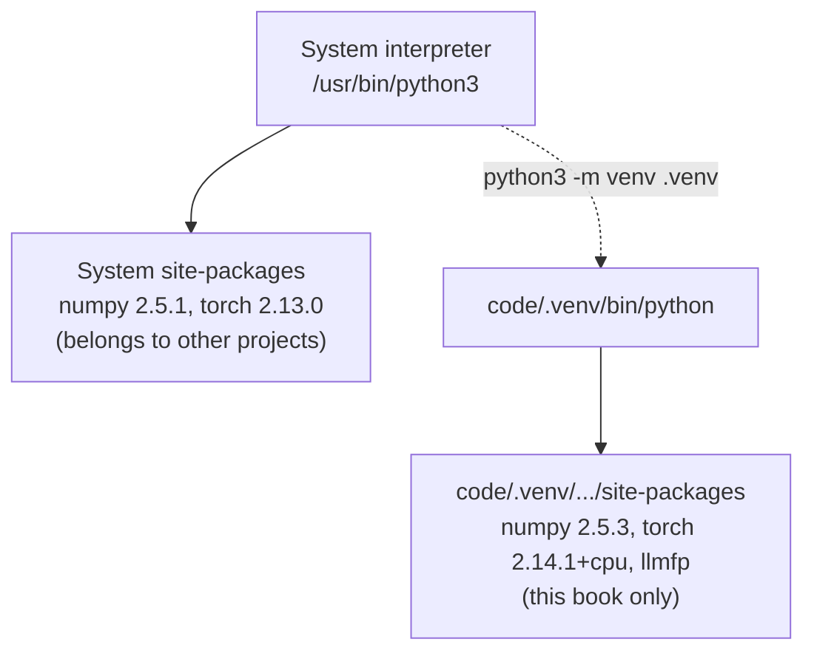
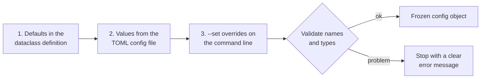

## Chapter 2: Python Foundations and Your Working Environment

[Back to index](../../README.md) · Previous: [Chapter 1](ch01-what-a-language-model-predicts.md) · Next: [Chapter 3](ch03-tensors.md)

Chapter 1's code ran with nothing but Python itself. From Chapter 3 onward, every chapter depends on outside libraries (NumPy, PyTorch, and later many more), on configuration files, and on tests. Machine-learning code is unusually sensitive to its environment: a different library version can change numerical results, change default settings, or refuse to load a saved model. This chapter builds the foundation that makes the rest of the book reproducible, and fills in the Python features the book relies on.

If you are an experienced Python developer, skim sections 2.4–2.8 and do the exercises. Do not skip sections 2.2, 2.3, 2.9, and 2.11: they set up the environment and the configuration system every later chapter uses.

#### Learning outcomes

By the end of this chapter you will be able to:

1. Explain what an interpreter, a package, a virtual environment, and a pinned dependency are, and why each matters for machine-learning work.
2. Create an isolated environment, install the book's package with exact dependency versions, and verify the installation.
3. Choose the right PyTorch build for your hardware, and explain why the choice matters.
4. Use the Python collections, function features, class features, and generators that the rest of the book relies on, and avoid their classic traps.
5. Read and write text files, JSON, and TOML safely, with explicit encodings.
6. Drive a script from a TOML configuration file with validated command-line overrides, and use logging rather than `print` for diagnostics.
7. Write and run pytest tests using fixtures, parametrization, and expected-exception checks.

#### Prerequisites

- [Chapter 1](ch01-what-a-language-model-predicts.md), especially the counting model (sections 1.8–1.9), which this chapter turns into an installed package.
- A terminal you can type commands into, and about 1 GB of free disk space.
- An internet connection for installing packages (about 200 MB to download on Linux CPU-only machines, more for GPU builds).

#### New terms in this chapter

| Term | Plain-English meaning | Section |
|---|---|---|
| Interpreter | The program (`python3`) that reads and runs Python code | 2.2 |
| Package / distribution | An installable bundle of Python code, with a name and a version | 2.2 |
| PyPI | The Python Package Index, the public server `pip` downloads packages from | 2.2 |
| pip | Python's standard tool for installing packages | 2.2 |
| Wheel | A pre-built package file for a specific Python version and platform | 2.2 |
| site-packages | The directory where an environment's installed packages live | 2.2 |
| Virtual environment | A self-contained directory of installed packages tied to one interpreter | 2.2 |
| Dependency (direct, transitive) | A package your code needs (directly, or because another dependency needs it) | 2.2 |
| Pinning | Requiring an exact version of a dependency | 2.2 |
| Lock file | A list of the exact version of every installed package, direct and transitive | 2.2, 2.3 |
| `pyproject.toml` | The file that describes a Python project: name, version, dependencies, tool settings | 2.3 |
| Editable install | Installing a project so that Python imports its source files directly; edits take effect without reinstalling | 2.3 |
| Type hint | An annotation describing the expected type of a value; not enforced when the program runs | 2.5 |
| Generator | A function that produces values one at a time, on demand, using `yield` | 2.7 |
| Encoding | The rule that converts text characters to bytes and back, such as UTF-8 | 2.8 |
| TOML | A configuration file format designed to be written by people; supports comments | 2.8 |
| Configuration override | A command-line setting that replaces a value from the configuration file | 2.9 |
| Logging | Recording diagnostic messages with a severity level and timestamp, separately from the program's real output | 2.9 |
| Fixture (pytest) | A value or resource that pytest creates for a test, such as a temporary directory | 2.10 |
| Parametrized test | One test function run several times with different inputs | 2.10 |

---

### 2.1 The problem: code that runs today and next month, on your machine and another

Chapter 1 left three problems that would hurt badly in later chapters.

**Problem 1: the import path.** The Chapter 1 scripts worked only when run as modules from inside `code/` (`python3 -m scripts.ch01_counting_demo`). Run from anywhere else, or as `python3 scripts/ch01_counting_demo.py`, they failed with `ModuleNotFoundError: No module named 'llmfp'`. That was tolerable for one chapter. It is not tolerable for a codebase that will grow to dozens of modules, test files, and notebooks.

**Problem 2: versions.** Your machine may already have NumPy or PyTorch installed, at some version, for some other project. Machine-learning libraries change between versions in ways that matter here: default settings change, functions are renamed or removed, numerical results differ slightly, and a model saved with one version may not load in another. If the book's results came from PyTorch 2.14.1 and you run 2.9, a difference in output could be your bug, the book's bug, or a version difference, and you cannot tell which. This is not hypothetical. The machine used to test this book had NumPy 2.5.1 and PyTorch 2.13.0 installed system-wide, both different from the versions this book pins, as you will see in Exercise 1.

**Problem 3: silent configuration mistakes.** Chapter 1's demo took settings as command-line flags. Training runs in later chapters have dozens of settings. If you misspell one (`--context-szie 3`) and the program silently ignores it, you will run a different experiment from the one you think you ran, and nothing will tell you. Wasted hours of training and wrong conclusions are the result.

This chapter fixes all three:

- A **virtual environment** with **pinned dependency versions** (sections 2.2–2.3) makes every reader's environment match the one the book was tested in, and a **check script** verifies it.
- An **editable install** of the book's package (section 2.3) makes `import llmfp` work from anywhere.
- A **configuration system** (section 2.9) reads settings from a file, accepts overrides, and rejects misspelled or mistyped settings with a clear error.

In between, sections 2.4–2.8 cover the Python features the book relies on, each with a runnable example and its real output.

---

### 2.2 Interpreters, virtual environments, packages, and pinned dependencies

#### The interpreter

When you type `python3 script.py`, the program `python3` is the **interpreter**: it reads your code and runs it. A machine can have several interpreters installed at once, such as an operating-system Python, one from python.org, and one inside each virtual environment. Each is a separate program in a separate location. To see which one is running, ask it:

```bash
python3 -c "import sys; print(sys.executable, sys.version)"
```

Many confusing errors ("I installed it, but Python says it's not there") come down to installing with one interpreter and running with another. Section 2.12 returns to this.

#### Packages, PyPI, pip, and wheels

A **package** (formally a *distribution*) is an installable bundle of code with a name and a version number, such as `numpy` version `2.5.3`. Most packages are published on **PyPI**, the Python Package Index (pypi.org). **pip** is the standard installer: it downloads a package from PyPI (or another server you name), along with the packages it depends on, and copies them into your environment.

The name you install is not always the name you import. `pip install numpy` gives you `import numpy`, and `pip install torch` gives you `import torch`, but some packages differ (for example, the package `scikit-learn` is imported as `sklearn`). When an import fails, check the package's documentation for its install name.

Many packages, including NumPy and PyTorch, contain compiled code written in languages such as C++ and CUDA, not only Python. Compiling that code yourself would take a long time and require special tools, so publishers provide **wheels**: pre-built package files for a specific Python version, operating system, and processor type. The wheel filename says what it is built for. For example, `torch-2.14.1+cpu-cp314-cp314-manylinux_2_28_x86_64.whl` is PyTorch 2.14.1, CPU-only build, for CPython 3.14, for 64-bit Intel/AMD Linux. If no wheel matches your Python version and platform, pip either tries to compile from source (slow, often fails) or reports that no matching version exists. That is why the book requires Python 3.12 or newer: the current NumPy release publishes wheels only for 3.12 and later.

#### Where packages live: site-packages and the import path

Each interpreter has a **site-packages** directory where installed packages are copied. When your code runs `import numpy`, Python searches a list of directories, called the *import path* and available as `sys.path`, in order, and uses the first match. The import path normally includes the directory of the script being run (or the current directory, with `python -m`), then the standard library, then site-packages.

That search order explains Chapter 1's import trick: `python3 -m scripts.ch01_counting_demo` put the current directory, `code/`, on the import path, so `import llmfp` found the `llmfp/` directory sitting there.

#### Virtual environments

A **virtual environment** is a directory containing its own site-packages, linked to one interpreter. When you run the environment's Python, it imports packages from the environment's own site-packages and ignores the packages installed in other environments.



Why bother?

- **Isolation.** This book's pinned versions do not break your other projects, and their versions do not break this book.
- **Disposability.** If an environment gets into a confused state, delete the `.venv` directory and recreate it in a couple of minutes. Nothing else on your machine is affected.
- **Protecting the system.** Some operating systems rely on their own Python installation. Many Linux distributions now refuse `pip install` into the system Python, with an `externally-managed-environment` error, precisely to prevent damage. A virtual environment avoids that conflict.

Python's built-in `venv` module creates environments. Other tools exist (conda, uv, poetry, pipenv), each with its own advantages. This book uses `venv` and `pip` because they come with Python and behave the same way everywhere. If you already use another tool, the concepts transfer directly; translate the commands.

#### Dependencies, pinning, and lock files

A **dependency** is a package your code needs. **Direct** dependencies are the ones your code imports: this book's code imports `numpy` and `torch`. **Transitive** dependencies are the packages your dependencies need: PyTorch, for example, needs `sympy`, `networkx`, `jinja2`, and others. You did not ask for them, but they are installed, and their versions can matter too.

A version **specifier** says which versions are acceptable:

| Specifier | Meaning | Tradeoff |
|---|---|---|
| `numpy` | Any version | Different readers get different versions at different times |
| `numpy>=2.5` | 2.5 or newer | Gets fixes automatically, and also gets breaking changes automatically |
| `numpy==2.5.3` | Exactly 2.5.3 (**pinned**) | Everyone gets the same version; you must update deliberately |

For a book whose outputs you will compare against, exact pins are the right choice: when your result differs from the book's, the version is ruled out as a cause. The cost is that you will not automatically receive bug fixes. Production projects often pin exactly in a separate **lock file** and keep looser ranges in the project description. A lock file records the exact version of *every* installed package, direct and transitive, so an environment can be rebuilt identically. This book does both: exact pins for direct dependencies in `pyproject.toml`, and a lock file for the Linux CPU environment it was tested in.

---

### 2.3 Setting up the book repository

This section creates the environment. Each step is explained; do them in order. Commands are shown for Linux and macOS (bash or zsh) and for Windows (PowerShell). Lines starting with `#` are comments.

> **What was tested.** The steps below were executed on Linux x86_64 with Python 3.14.4, CPU only, on 2026-10-02. The macOS, Windows, and GPU commands follow the official package metadata and the PyTorch download server's contents as checked on that date, but were **not executed** by the author. If one fails for you, Appendix B (planned) and section 2.12 cover the common causes.

#### Step 1: check your Python version

```bash
python3 --version      # Linux / macOS
py --version           # Windows
```

You need **3.12 or newer**. If you have an older version, install a current one from python.org or your operating system's package manager. Several Python versions can coexist; on Linux and macOS you may need to run, for example, `python3.12` explicitly, and on Windows `py -3.12`.

#### Step 2: create a virtual environment

From the repository's `code/` directory:

```bash
cd code
python3 -m venv .venv          # Linux / macOS
py -m venv .venv               # Windows
```

This creates `code/.venv/`, containing a copy of (or link to) the interpreter, its own site-packages, and its own pip. The name `.venv` is a common convention; the leading dot hides it in directory listings on Linux and macOS. It is excluded from version control by `.gitignore`, because it is machine-specific and can always be rebuilt.

#### Step 3: activate it

```bash
source .venv/bin/activate      # Linux / macOS (bash, zsh)
.venv\Scripts\Activate.ps1     # Windows PowerShell
.venv\Scripts\activate.bat     # Windows Command Prompt
```

Your prompt usually changes to start with `(.venv)`. Activation does one important thing: it puts the environment's `bin` (or `Scripts`) directory at the front of your `PATH`, so typing `python` or `pytest` runs the environment's copies. It lasts until you close the terminal or type `deactivate`. **You must activate the environment in every new terminal** before running the book's code. Alternatively, skip activation and call the environment's interpreter directly, as in `.venv/bin/python -m pytest` (`.venv\Scripts\python -m pytest` on Windows).

From here on, commands use `python`, meaning the environment's interpreter, rather than `python3` or `py`.

#### Step 4: install PyTorch for your hardware

PyTorch publishes different builds for different hardware, and the default download is not always the one you want.

| Your machine | Command | Notes |
|---|---|---|
| Linux, no NVIDIA GPU (the book's tested path) | `python -m pip install torch==2.14.1 --index-url https://download.pytorch.org/whl/cpu` | CPU-only build, about 200 MB |
| Linux with an NVIDIA GPU | `python -m pip install torch==2.14.1 --index-url https://download.pytorch.org/whl/cu130` | Builds for CUDA 12.6 (`cu126`), 13.0 (`cu130`), and 13.2 (`cu132`) exist for this version. Your NVIDIA driver must support the CUDA version you choose; the selector at pytorch.org/get-started/locally shows the current recommendation. Not tested by the author |
| macOS (Apple Silicon) | `python -m pip install torch==2.14.1` | Includes Apple's GPU backend (MPS). Not tested by the author |
| Windows | `python -m pip install torch==2.14.1` | PyPI's Windows build is CPU-only. For an NVIDIA GPU, use the `--index-url` form with the matching `cu` suffix. Not tested by the author |

Why not plain `pip install torch` on Linux? Because PyPI's Linux build of PyTorch 2.14.1 declares dependencies on NVIDIA's CUDA 13 libraries (`cuda-toolkit`, `nvidia-cudnn-cu13`, and others, according to the package's published metadata). On a machine without an NVIDIA GPU, those are gigabytes of downloads you cannot use. The `--index-url` option tells pip to download from PyTorch's own server, which hosts the CPU-only build. That build's version is `2.14.1+cpu`: the `+cpu` part is a *local version label* that marks a build variant. It still satisfies a requirement of `torch==2.14.1`.

On the test machine, this step took about 48 seconds.

Why `python -m pip` rather than `pip`? `python -m pip` runs the pip that belongs to the interpreter you named, so packages are guaranteed to go into that interpreter's environment. A bare `pip` command may belong to a different Python. With an activated environment the two are usually the same, but the `-m` form is never wrong.

#### Step 5: install the book's package

```bash
python -m pip install -e ".[dev]"
```

Piece by piece:

- `-e` means **editable**: instead of copying `llmfp` into site-packages, pip records where the source directory is. Python then imports your files directly, so edits to `llmfp/*.py` take effect immediately, with no reinstall. Re-run the command only when `pyproject.toml` changes or you add a new top-level package.
- `.` means "the project in the current directory", described by `pyproject.toml`.
- `[dev]` means "also install the optional `dev` group of dependencies", which contains pytest.
- The quotes stop shells such as zsh from interpreting the square brackets as a filename pattern.

pip sees that `torch==2.14.1` is already satisfied by the CPU build from step 4 and leaves it alone. It installs NumPy, pytest, and their dependencies from PyPI.

#### Step 6: verify

```bash
python -m scripts.ch02_check_env
pytest
```

Observed output of the check on the test machine:

```text
Python      3.14.4  (/home/sankar/ai/learn-llm/code/.venv/bin/python)
Virtual env yes  (prefix: /home/sankar/ai/learn-llm/code/.venv)
numpy       2.5.3          expected 2.5.3  ok
torch       2.14.1+cpu     expected 2.14.1  ok
pytest      9.1.1          expected 9.1.1  ok
tokenizers  0.23.2         expected 0.23.2  ok
llmfp       0.3.0
torch CUDA  available=False  build=None
torch MPS   available=False

All checks passed.
```

Then `pytest -q`, from `code/` (the book's build also passes `-p no:cacheprovider`, which only stops pytest from writing a `.pytest_cache` folder):

```text
...................................................                      [100%]
51 passed in 0.07s
```

The 51 tests include all of Chapter 1's tests, running unchanged under pytest, plus this chapter's. (The command shown above lists this chapter's test files explicitly; a bare `pytest` runs every chapter's tests, so it reports more tests once you have later chapters' code.)

#### The alternative: install from the lock file (Linux CPU only)

The file [`code/requirements/linux-cpu-lock.txt`](../../code/requirements/linux-cpu-lock.txt) records every package in the tested environment:

```text
# Exact versions of every package in the tested environment (Linux x86_64, CPU-only).
# Generated with: python -m pip freeze --exclude-editable  (updated in Chapter 9)
# Install with: python -m pip install -r requirements/linux-cpu-lock.txt
--index-url https://download.pytorch.org/whl/cpu
--extra-index-url https://pypi.org/simple
anyio==4.15.1
certifi==2026.7.22
click==8.5.0
filelock==3.32.3
fsspec==2026.7.0
h11==0.16.0
hf-xet==1.6.0
httpcore==1.0.9
httpx==0.28.1
huggingface_hub==1.33.0
idna==3.20
iniconfig==2.3.0
Jinja2==3.1.6
MarkupSafe==3.0.3
mpmath==1.3.0
networkx==3.6.1
numpy==2.5.3
packaging==26.3
pluggy==1.6.0
Pygments==2.21.0
pytest==9.1.1
PyYAML==6.0.3
setuptools==78.1.0
sympy==1.14.0
tokenizers==0.23.2
torch==2.14.1+cpu
tqdm==4.70.1
typing_extensions==4.16.0
```

On Linux x86_64 without a GPU, you can replace steps 4 and 5 with:

```bash
python -m pip install -r requirements/linux-cpu-lock.txt
python -m pip install --no-deps -e .
```

The `--index-url` and `--extra-index-url` lines inside the file make pip look on PyTorch's server first and PyPI second. `--no-deps` installs `llmfp` itself without re-resolving its dependencies, which the lock file has already fixed. The author verified this route by building a second, fresh environment from the lock file: it produced an identical package list, and all tests passed. The lock file does not apply to macOS or to GPU builds, because their PyTorch builds and transitive dependencies differ.

#### The project description: `pyproject.toml`

File: [`code/pyproject.toml`](../../code/pyproject.toml). The listing shows the file as it currently stands in the repository. Later chapters add dependencies, each pinned in the chapter that first needs it (Chapter 9 adds `tokenizers`), and the environment check and lock file grow accordingly.

```toml
# Package metadata and dependencies for the book's companion code.
# Chapter 2 explains every line. Install from this directory with:
#   python -m pip install -e ".[dev]"
# (Install PyTorch first on Linux CPU-only machines; see Chapter 2.3.)

[build-system]
requires = ["setuptools>=77"]
build-backend = "setuptools.build_meta"

[project]
name = "llmfp"
version = "0.3.0"
description = "Companion code for 'Large Language Models From First Principles'"
readme = "README.md"
requires-python = ">=3.12"
# Exact pins: every reader gets the versions the book was tested with.
dependencies = [
    "numpy==2.5.3",
    "torch==2.14.1",
    "tokenizers==0.23.2",   # Chapter 9: Hugging Face tokenizers, to compare with published tokenizers
]

[project.optional-dependencies]
# Tools for developing and testing, not needed to run the models.
dev = [
    "pytest==9.1.1",
]

[tool.setuptools.packages.find]
# Only the library is installed. scripts/, solutions/, and tests/ are run in place.
include = ["llmfp*"]

[tool.pytest.ini_options]
testpaths = ["tests"]
# Put code/ on the import path so tests can import scripts and solutions too.
pythonpath = ["."]
addopts = "-ra"
```

What each part does:

- **`[build-system]`** tells pip which tool builds the package. `setuptools` is the long-standing standard; pip downloads it into a temporary, isolated environment just for the build.
- **`[project]`** holds the metadata: the package's name (`llmfp`), its version, the Python versions it supports (`requires-python`), and its direct dependencies, pinned exactly. pip refuses to install the package on an interpreter older than 3.12.
- **`[project.optional-dependencies]`** declares groups of extra dependencies that are installed only on request, such as `.[dev]`. pytest is needed to develop and test the code, not to run models, so it lives here.
- **`[tool.setuptools.packages.find]`** says which directories are part of the installed package. Only `llmfp` is; scripts, solutions, examples, and tests are run in place from `code/`.
- **`[tool.pytest.ini_options]`** configures pytest (section 2.10).

Now `import llmfp` works from any directory, in any script, as long as the environment is active. `python -m scripts.<name>` remains the way to run the book's scripts, because `scripts/` is deliberately not installed.

---

### 2.4 Collections used throughout the book

Most code in this book moves data between a handful of built-in collection types. Each has a job, and choosing the wrong one causes bugs that are tedious to find. The example below exercises each type with harbor tokens.

File: [`code/examples/ch02/collections_tour.py`](../../code/examples/ch02/collections_tour.py)

```python
"""Chapter 2.4: the collection types this book uses constantly.

Run from `code/`:  python examples/ch02/collections_tour.py
"""

from collections import Counter, defaultdict
from dataclasses import asdict, dataclass, field, replace

tokens = ["the", "keeper", "lit", "the", "lamp", "."]

# list: ordered, changeable, allows duplicates. Our token sequences are lists.
print("list      ", tokens, "| length", len(tokens), "| first", tokens[0], "| last two", tokens[-2:])

# tuple: ordered, NOT changeable. Usable as a dictionary key; a list is not.
context = ("the", "keeper")
print("tuple     ", context)
try:
    {["the", "keeper"]: 1}
except TypeError as error:
    print("list as key fails:", error)

# dict: maps keys to values. A vocabulary maps each token to an integer ID.
vocab = {token: index for index, token in enumerate(sorted(set(tokens)))}
print("dict      ", vocab)
print("lookup    ", vocab["lamp"], "| missing with .get:", vocab.get("boats"), "| with default:", vocab.get("boats", -1))

# set: unordered, no duplicates, fast membership tests.
unique = set(tokens)
print("set       ", sorted(unique), "| 'lamp' in set:", "lamp" in unique)

# Counter: a dict that counts. Missing keys count as 0 instead of raising KeyError.
counts = Counter(tokens)
print("Counter   ", counts.most_common(2), "| count of 'boats':", counts["boats"])

# defaultdict: creates a default value the first time a missing key is used.
followers = defaultdict(Counter)
for previous, current in zip(tokens, tokens[1:]):
    followers[previous][current] += 1
print("defaultdict", dict(followers))


# dataclass: a class whose main job is to hold named fields.
@dataclass(frozen=True)  # frozen: fields cannot be changed after creation
class TrainingSettings:
    steps: int = 100
    learning_rate: float = 0.001
    tags: list[str] = field(default_factory=list)  # each instance gets its own new list


settings = TrainingSettings(steps=500)
print("dataclass ", settings)
print("as dict   ", asdict(settings))
print("replace   ", replace(settings, learning_rate=0.01))  # a modified copy
try:
    settings.steps = 1  # type: ignore[misc]
except AttributeError as error:
    print("frozen    ", type(error).__name__, "-", error)
```

Run it from `code/` with `python examples/ch02/collections_tour.py`. Observed output:

```text
list       ['the', 'keeper', 'lit', 'the', 'lamp', '.'] | length 6 | first the | last two ['lamp', '.']
tuple      ('the', 'keeper')
list as key fails: cannot use 'list' as a dict key (unhashable type: 'list')
dict       {'.': 0, 'keeper': 1, 'lamp': 2, 'lit': 3, 'the': 4}
lookup     2 | missing with .get: None | with default: -1
set        ['.', 'keeper', 'lamp', 'lit', 'the'] | 'lamp' in set: True
Counter    [('the', 2), ('keeper', 1)] | count of 'boats': 0
defaultdict {'the': Counter({'keeper': 1, 'lamp': 1}), 'keeper': Counter({'lit': 1}), 'lit': Counter({'the': 1}), 'lamp': Counter({'.': 1})}
dataclass  TrainingSettings(steps=500, learning_rate=0.001, tags=[])
as dict    {'steps': 500, 'learning_rate': 0.001, 'tags': []}
replace    TrainingSettings(steps=500, learning_rate=0.01, tags=[])
frozen     FrozenInstanceError - cannot assign to field 'steps'
```

What to take from each:

| Type | Key property | Where the book uses it |
|---|---|---|
| `list` | Ordered, changeable, indexable; slicing with negative indexes counts from the end | Token sequences; batches of examples |
| `tuple` | Ordered, unchangeable, so it can be a dictionary key | Counting-model contexts (Ch 1); tensor shapes (Ch 3) |
| `dict` | Maps keys to values; `.get` returns a default instead of raising `KeyError` | Vocabularies, mapping tokens to IDs (Ch 8–9); configuration data |
| `set` | No duplicates, fast `in` checks | Collecting unique tokens; deduplication (Ch 18) |
| `Counter` | A dict of counts; missing keys count as 0 | Counting tokens and pairs (Ch 1, Ch 9) |
| `defaultdict` | Creates a default value the first time a missing key is accessed | Building nested tables (Ch 1) |
| `@dataclass` | A class defined by its named fields | Every configuration object in the book |

Three details deserve attention.

**Tuples, not lists, as keys.** The error message (`unhashable type: 'list'`) says it: a dictionary needs keys whose value can never change, because it files each entry under a fingerprint computed from the key, called a *hash*. A list can change after it is stored, so Python refuses it. That is why Chapter 1's model stored contexts as tuples, and why loading its checkpoint converts the JSON lists back into tuples.

**`frozen=True`.** A frozen dataclass cannot be modified after creation. Configuration objects in this book are frozen, so no part of a program can quietly change a setting halfway through a run. To vary a setting, make a modified copy with `dataclasses.replace`.

**`field(default_factory=list)`.** A dataclass field whose default is a changeable object, such as a list, must use `default_factory`, which builds a *new* object for each instance. Writing `tags: list[str] = []` is rejected by the dataclass machinery for exactly the reason explained in section 2.5's mutable-default example.

---

### 2.5 Functions, keyword arguments, defaults, and type hints

File: [`code/examples/ch02/functions_tour.py`](../../code/examples/ch02/functions_tour.py)

```python
"""Chapter 2.5: functions, keyword arguments, defaults, and type hints.

Run from `code/`:  python examples/ch02/functions_tour.py
"""

from __future__ import annotations


# Type hints describe what a function expects and returns. Python does not
# enforce them at run time; editors and tools use them to catch mistakes.
def top_tokens(counts: dict[str, int], limit: int = 3) -> list[str]:
    """Return the `limit` most frequent tokens."""
    return sorted(counts, key=counts.get, reverse=True)[:limit]


counts = {"the": 5, "keeper": 2, "lamp": 3, "boats": 1}
print("positional       ", top_tokens(counts, 2))
print("keyword          ", top_tokens(counts, limit=2))
print("default          ", top_tokens(counts))
print("hints not enforced", top_tokens(counts, limit=True))  # True behaves as 1; no error!


# The * makes every following parameter keyword-only. Use it for options whose
# meaning would be unclear as a bare positional value.
def generate(prompt: str, *, max_new_tokens: int = 20, greedy: bool = False) -> str:
    return f"generate({prompt!r}, max_new_tokens={max_new_tokens}, greedy={greedy})"


print("keyword-only      ", generate("the keeper", greedy=True))
try:
    generate("the keeper", 50, True)  # type: ignore[misc]
except TypeError as error:
    print("positional refused", error)


# Functions can return several values as a tuple, unpacked by the caller.
def split_pair(sequence: list[int]) -> tuple[list[int], list[int]]:
    """Inputs are every token but the last; targets are every token but the first."""
    return sequence[:-1], sequence[1:]


inputs, targets = split_pair([10, 11, 12, 13])
print("tuple return      ", inputs, targets)


# A classic bug: a mutable default value is created ONCE, when the function is
# defined, and shared by every call that uses the default.
def remember_bad(token: str, seen: list[str] = []) -> list[str]:  # noqa: B006 (deliberate bug)
    seen.append(token)
    return seen


def remember_good(token: str, seen: list[str] | None = None) -> list[str]:
    seen = [] if seen is None else seen
    seen.append(token)
    return seen


print("mutable default   ", remember_bad("a"), remember_bad("b"))   # second call still sees "a"
print("None default      ", remember_good("a"), remember_good("b"))


# Functions are values: they can be passed to other functions.
def apply_to_all(func, items):
    return [func(item) for item in items]


print("function as value ", apply_to_all(str.upper, ["lit", "lamp"]))
print("lambda            ", apply_to_all(lambda word: len(word), ["lit", "lamp"]))
```

Observed output:

```text
positional        ['the', 'lamp']
keyword           ['the', 'lamp']
default           ['the', 'lamp', 'keeper']
hints not enforced ['the']
keyword-only       generate('the keeper', max_new_tokens=20, greedy=True)
positional refused generate() takes 1 positional argument but 3 were given
tuple return       [10, 11, 12] [11, 12, 13]
mutable default    ['a', 'b'] ['a', 'b']
None default       ['a'] ['b']
function as value  ['LIT', 'LAMP']
lambda             [3, 4]
```

**Type hints are documentation that tools can check, not rules Python enforces.** `top_tokens(counts, limit=True)` ran without complaint even though `limit` is hinted as `int`, because Python treats `True` as the integer 1. Type hints make code easier to read and let editors and type-checking tools flag mistakes before you run anything. They do not protect you at run time. When a value comes from outside the program, such as a configuration file, you must check it yourself; section 2.9 does exactly that.

**Keyword-only parameters.** The bare `*` in `generate(prompt, *, max_new_tokens=20, greedy=False)` forces callers to name every argument after it. `generate("the keeper", 50, True)` is unreadable: is 50 a length, a seed, a temperature? Named arguments make calls self-describing, and they let parameters be reordered or added later without breaking callers. The book uses keyword-only parameters for options throughout.

**Returning several values.** `split_pair` returns a tuple that the caller unpacks into `inputs, targets`. It is also a small preview of Chapter 11: the inputs to a language model are a token sequence without its last token, and the targets are the same sequence without its first token. That one-position shift is the source of a famous family of bugs, and section 2.10 uses it as the example of a failing test.

**The mutable default trap.** `remember_bad("b")` returned `['a', 'b']`, remembering a value from the previous call. A default value is created *once*, when Python reads the `def` line, and every call that relies on the default receives that same list. Use `None` as the default and create the new object inside the function, as `remember_good` does. This bug produces no error message, only wrong results, which makes it worth recognizing on sight.

**Functions are values.** You can pass a function as an argument, as Chapter 1 did with `sorted(..., key=lambda item: (-item[1], item[0]))`. A `lambda` is a short, unnamed function written inline. You will see this pattern constantly with sorting, and in PyTorch code that applies a function to every layer of a model.

---

### 2.6 Classes, methods, properties, and `__call__`

PyTorch models are classes, and they lean on several class features that tutorials often use without explanation. This example builds a small vocabulary class and then imitates PyTorch's layer-calling pattern.

File: [`code/examples/ch02/classes_tour.py`](../../code/examples/ch02/classes_tour.py)

```python
"""Chapter 2.6: classes, methods, properties, inheritance, and special methods.

The final class mimics the calling pattern PyTorch uses for neural network
layers (Chapter 5): you *call* the object, and the call runs its `forward`
method. This is a teaching imitation, not how PyTorch is implemented.

Run from `code/`:  python examples/ch02/classes_tour.py
"""

from __future__ import annotations


class Vocabulary:
    """Maps tokens to integer IDs and back."""

    def __init__(self, tokens: list[str]) -> None:
        # Attributes are stored on `self`, the object being created.
        self.id_to_token = sorted(set(tokens))
        self.token_to_id = {token: i for i, token in enumerate(self.id_to_token)}

    # A regular method: called on an instance, receives it as `self`.
    def encode(self, tokens: list[str]) -> list[int]:
        return [self.token_to_id[token] for token in tokens]

    def decode(self, ids: list[int]) -> list[str]:
        return [self.id_to_token[i] for i in ids]

    # A property: computed on access, used like an attribute (no parentheses).
    @property
    def size(self) -> int:
        return len(self.id_to_token)

    # A class method: an alternative constructor. It receives the class, not an instance.
    @classmethod
    def from_text(cls, text: str) -> "Vocabulary":
        return cls(text.split())

    # Special ("dunder", double-underscore) methods plug into Python syntax.
    def __len__(self) -> int:  # len(vocab)
        return self.size

    def __contains__(self, token: str) -> bool:  # "lamp" in vocab
        return token in self.token_to_id

    def __repr__(self) -> str:  # how the object prints
        return f"Vocabulary(size={self.size})"


vocab = Vocabulary.from_text("the keeper lit the lamp")
print(vocab, "| len:", len(vocab), "| size property:", vocab.size, "| 'lamp' in vocab:", "lamp" in vocab)
ids = vocab.encode(["the", "lamp"])
print("encode:", ids, "| decode:", vocab.decode(ids))


# Inheritance: a subclass reuses its parent's code and changes some of it.
class VocabularyWithUnknown(Vocabulary):
    UNKNOWN = "<unk>"

    def __init__(self, tokens: list[str]) -> None:
        super().__init__(tokens + [self.UNKNOWN])  # run the parent's __init__ first

    def encode(self, tokens: list[str]) -> list[int]:
        unknown_id = self.token_to_id[self.UNKNOWN]
        return [self.token_to_id.get(token, unknown_id) for token in tokens]


safe = VocabularyWithUnknown("the keeper lit the lamp".split())
print("with <unk>:", safe.encode(["the", "boats"]), "->", safe.decode(safe.encode(["the", "boats"])))
print("isinstance of parent:", isinstance(safe, Vocabulary))


# __call__ lets an object be called like a function. PyTorch layers work this way:
# `layer(x)` runs extra bookkeeping and then `layer.forward(x)`.
class Layer:
    def __call__(self, value: float) -> float:
        print(f"  [{type(self).__name__}] called with {value}")
        return self.forward(value)

    def forward(self, value: float) -> float:
        raise NotImplementedError("subclasses define forward")


class Scale(Layer):
    def __init__(self, factor: float) -> None:
        self.factor = factor

    def forward(self, value: float) -> float:
        return value * self.factor


class Shift(Layer):
    def __init__(self, amount: float) -> None:
        self.amount = amount

    def forward(self, value: float) -> float:
        return value + self.amount


pipeline = [Scale(2.0), Shift(1.0)]
value = 3.0
for layer in pipeline:
    value = layer(value)  # calls __call__, which calls forward
print("pipeline result:", value)
```

Observed output:

```text
Vocabulary(size=4) | len: 4 | size property: 4 | 'lamp' in vocab: True
encode: [3, 1] | decode: ['the', 'lamp']
with <unk>: [4, 0] -> ['the', '<unk>']
isinstance of parent: True
  [Scale] called with 3.0
  [Shift] called with 6.0
pipeline result: 7.0
```

**`self` and `__init__`.** `__init__` runs when an object is created; it stores attributes on `self`, the new object. Every regular method receives the object as its first parameter, conventionally named `self`.

**Properties.** `vocab.size` looks like a stored attribute but runs a method. Use a property for a value that is computed from other state, so the value can never drift out of sync with that state.

**Class methods as alternative constructors.** `Vocabulary.from_text(...)` builds an object from a different kind of input. You have already used one: `CountingLanguageModel.load(path)` in Chapter 1 is a class method that constructs a model from a checkpoint. PyTorch libraries use the same pattern; `from_pretrained` in Chapter 23 is the best-known example.

**Special ("dunder") methods.** Methods with double underscores on both sides plug your class into Python's syntax: `__len__` makes `len(vocab)` work, `__contains__` makes `"lamp" in vocab` work, and `__repr__` controls how the object prints. In Chapter 11 you will write a PyTorch `Dataset`, which at its core is a class with `__len__` and `__getitem__` (the method behind `dataset[i]`).

**Inheritance and `super()`.** `VocabularyWithUnknown` reuses everything from `Vocabulary` and changes only `encode`. `super().__init__(...)` runs the parent class's initializer. Chapter 1's `BackoffLanguageModel` solution used the same technique, and every PyTorch model you write will inherit from PyTorch's `nn.Module`.

**`__call__` and `forward`.** This is the pattern to remember for Chapter 5. In PyTorch, you define a layer's computation in a method named `forward`, but you never call `forward` directly. You call the layer object itself: `output = layer(x)`. That works because PyTorch's base class defines `__call__`, which does some bookkeeping and then calls your `forward`. The `Layer` class above imitates that arrangement: each call printed a line (the "bookkeeping") and then ran the subclass's `forward`. **This is a teaching imitation.** PyTorch's real `__call__` does considerably more (Chapter 5 shows some of it), but the division of labor is the same: you write `forward`, and you call the object.

---

### 2.7 Iterators and generators: processing data lazily

Training data for language models is often far larger than memory. Generators let a program process data one piece at a time, holding only the current piece. They also have one trap that has bitten nearly every Python programmer, including, potentially, Chapter 1's backoff model.

File: [`code/examples/ch02/generators_tour.py`](../../code/examples/ch02/generators_tour.py)

```python
"""Chapter 2.7: iterators and generators.

Run from `code/`:  python examples/ch02/generators_tour.py
"""

from __future__ import annotations

import itertools
from pathlib import Path
from typing import Iterator

# An iterable is anything a for-loop can walk over. An iterator is the object
# that does the walking: each next() call returns one item until it is used up.
tokens = ["the", "keeper", "lit"]
iterator = iter(tokens)
print("next:", next(iterator), next(iterator), next(iterator))
try:
    next(iterator)
except StopIteration:
    print("StopIteration: the iterator is used up; the list itself is unchanged:", tokens)


# A generator function uses `yield`. Calling it runs nothing yet; it returns a
# generator, which runs the body only as items are requested.
def numbered_lines(path: str | Path) -> Iterator[tuple[int, str]]:
    print("  (generator started)")
    with open(path, encoding="utf-8") as file:
        for number, line in enumerate(file, start=1):  # reads one line at a time
            line = line.strip()
            if line:
                yield number, line
    print("  (generator finished, file closed)")


lines = numbered_lines("data/tiny/harbor.txt")
print("created:", type(lines).__name__, "- nothing has been read yet")
print("first two:", list(itertools.islice(lines, 2)))  # reads only as much as needed


# Generators let you process files far larger than memory: only the current line
# is held at once. Here we count tokens without storing the file.
total_tokens = sum(len(line.split()) for _, line in numbered_lines("data/tiny/harbor.txt"))
print("total whitespace-separated tokens:", total_tokens)


# THE ONE-SHOT TRAP: an iterator or generator can be consumed only once.
def sentences():
    yield "the keeper lit the lamp"
    yield "the boats left the harbor"


gen = sentences()
first_pass = [s.split()[1] for s in gen]
second_pass = [s.split()[1] for s in gen]  # silently empty: no error, no data
print("first pass:", first_pass, "| second pass:", second_pass)

# The fix, when you need several passes: make a list once (if it fits in memory),
# or call the generator function again for each pass.
materialized = list(sentences())
print("list, pass 1:", len(materialized), "| list, pass 2:", len(materialized))


# Batching a stream: a pattern used for training data in Chapter 11.
def batched(items, size):
    iterator = iter(items)
    while batch := list(itertools.islice(iterator, size)):
        yield batch


print("batches of 3:", list(batched(range(8), 3)))
```

Observed output:

```text
next: the keeper lit
StopIteration: the iterator is used up; the list itself is unchanged: ['the', 'keeper', 'lit']
created: generator - nothing has been read yet
  (generator started)
first two: [(1, 'The keeper lit the lamp at dusk.'), (2, 'The keeper climbed the stairs to the lamp.')]
  (generator started)
  (generator finished, file closed)
total whitespace-separated tokens: 279
first pass: ['keeper', 'boats'] | second pass: []
list, pass 1: 2 | list, pass 2: 2
batches of 3: [[0, 1, 2], [3, 4, 5], [6, 7]]
```

**Iterables and iterators.** An *iterable* is anything a `for` loop can walk over: lists, strings, files, dictionaries, ranges. An *iterator* is the object doing the walking: each `next()` returns one item, and when nothing is left it raises `StopIteration`, which `for` loops handle silently. A list can be walked over any number of times, because each `for` loop makes a fresh iterator. An iterator itself, once used up, stays used up.

**Generators are lazy.** Calling `numbered_lines(...)` printed nothing: the function body did not run. It ran only when `islice` asked for items, and it stopped after two lines. The second call, consumed fully by `sum(...)`, ran to completion and printed that it had closed the file. (The first generator was abandoned after two lines; its file is closed when Python cleans up the abandoned generator. For long-running programs, consume generators fully or close them explicitly.) The token-counting line processed the whole file while holding one line at a time, which is how Chapter 18 processes datasets of many gigabytes.

**The one-shot trap.** The second pass over `gen` produced an empty list, with no error. Any code that loops over its input twice will silently get nothing the second time if it receives a generator instead of a list. Look back at Chapter 1's [`BackoffLanguageModel.train`](../../code/solutions/ch01_backoff.py): it trains several internal models on the same lines, so its first statement is `lines = list(lines)`. Without that line, the first internal model would consume the generator, and every other model would silently train on nothing. Exercise 4 has you write a test that catches exactly this bug.

**Batching.** `batched` groups a stream into fixed-size pieces, with a shorter final piece. The `while batch := ...` line uses the *assignment expression* operator `:=`, which assigns a value and tests it in one step: the loop continues while the batch is non-empty. Chapter 11 batches training examples the same way, with PyTorch's `DataLoader` handling the details.

---

### 2.8 Files, paths, text encodings, JSON, and TOML

File: [`code/examples/ch02/files_tour.py`](../../code/examples/ch02/files_tour.py)

```python
"""Chapter 2.8: paths, text encodings, JSON, and TOML.

Writes only inside a temporary directory, which is deleted at the end.
Run from `code/`:  python examples/ch02/files_tour.py
"""

import json
import locale
import tempfile
import tomllib
from pathlib import Path

with tempfile.TemporaryDirectory() as tmp:
    root = Path(tmp)

    # pathlib: build paths with "/", which works on every operating system.
    path = root / "notes" / "harbor.txt"
    path.parent.mkdir(parents=True, exist_ok=True)
    print("name:", path.name, "| suffix:", path.suffix, "| stem:", path.stem, "| parent:", path.parent.name)

    # Text vs bytes. Text is characters; files store bytes. An *encoding* is the
    # rule that converts between them. Always say which encoding you mean.
    text = "Café at the pier ☕"
    path.write_text(text, encoding="utf-8")
    raw = path.read_bytes()
    print("characters:", len(text), "| bytes on disk (UTF-8):", len(raw))
    print("first bytes:", raw[:6])
    print("default encoding on this machine:", locale.getpreferredencoding(False))

    # Reading with the wrong encoding garbles text or fails outright.
    print("read as latin-1:", repr(path.read_text(encoding="latin-1")))
    try:
        path.read_text(encoding="ascii")
    except UnicodeDecodeError as error:
        print("read as ascii: UnicodeDecodeError -", error.reason)

    # JSON: the format for data that programs write and read back.
    record = {"run": "demo", "context_size": 2, "tokens": ["the", "lamp"], "loss": None}
    json_path = root / "record.json"
    json_path.write_text(json.dumps(record, indent=2, sort_keys=True), encoding="utf-8")
    loaded = json.loads(json_path.read_text(encoding="utf-8"))
    print("JSON round trip equal:", loaded == record, "| None became:", json.dumps(None))
    print("JSON turns tuples into lists:", json.loads(json.dumps({"context": ("the", "keeper")})))

    # TOML: the format for configuration that people write by hand. It allows
    # comments, which JSON does not. Python can read TOML, but not write it.
    toml_path = root / "config.toml"
    toml_path.write_text(
        '# a comment\nseed = 0\n\n[model]\ncontext_size = 2\nlowercase = true\n', encoding="utf-8"
    )
    with open(toml_path, "rb") as file:  # tomllib needs binary mode
        config = tomllib.load(file)
    print("TOML:", config)

    # Listing files.
    print("files:", sorted(p.relative_to(root).as_posix() for p in root.rglob("*") if p.is_file()))

print("temporary directory removed:", not root.exists())
```

Observed output:

```text
name: harbor.txt | suffix: .txt | stem: harbor | parent: notes
characters: 18 | bytes on disk (UTF-8): 21
first bytes: b'Caf\xc3\xa9 '
default encoding on this machine: UTF-8
read as latin-1: 'Café at the pier â\x98\x95'
read as ascii: UnicodeDecodeError - ordinal not in range(128)
JSON round trip equal: True | None became: null
JSON turns tuples into lists: {'context': ['the', 'keeper']}
TOML: {'seed': 0, 'model': {'context_size': 2, 'lowercase': True}}
files: ['config.toml', 'notes/harbor.txt', 'record.json']
temporary directory removed: True
```

**Paths.** `pathlib.Path` objects join with `/`, which produces correct paths on every operating system, and expose the parts of a path as attributes (`.name`, `.suffix`, `.parent`). The book uses `Path` everywhere instead of building path strings by hand.

**Text is not bytes.** A file stores bytes. Text is a sequence of characters. An **encoding** is the rule that converts between the two. UTF-8, the dominant encoding today, uses one byte for basic English letters and more for other characters: the 18-character string above became 21 bytes, because `é` takes two bytes and `☕` takes three. Read those bytes with the wrong encoding and you get garbled text (`Latin-1` turned `é` into `é`) or an error (`ascii` refused outright). Chapter 8 explains encodings in depth, because a tokenizer that operates on bytes depends on these details.

**Always pass `encoding="utf-8"`.** When you omit the encoding, Python uses a default that depends on the operating system and its settings. It printed `UTF-8` on the test machine, but historically it has been something else on many Windows systems. Code that works on one machine and garbles text on another is a reproducibility failure, so every file read and write in this book names its encoding explicitly.

**JSON for data that programs write.** JSON represents dictionaries, lists, strings, numbers, booleans, and `null` (Python's `None`). It has no tuples: a tuple goes in and a list comes out. Code that saves tuples to JSON must convert them back on loading, as Chapter 1's checkpoint loader did. `sort_keys=True` writes keys in a fixed order, so two JSON files describing the same data are identical and can be compared line by line.

**TOML for configuration that people write.** TOML looks like an INI file with proper types (`2` is an integer, `true` a boolean, `"text"` a string) and sections in square brackets. Unlike JSON, it allows comments, which matter in a configuration file: a comment explains *why* a value was chosen. Python's standard library can read TOML (`tomllib`, since Python 3.11) but cannot write it. The book therefore writes hand-edited configuration in TOML and machine-written records in JSON.

---

### 2.9 Command-line scripts, configuration, and logging

This section builds the configuration system that every later training script uses. It solves Problem 3 from section 2.1: settings come from a file, can be overridden from the command line, and are checked, so that a misspelled or mistyped setting stops the program instead of being silently ignored.

#### Where settings come from

Settings are resolved in layers. Each layer overrides the one before:



Defaults make a script usable with no file at all. The file records a complete, commented experiment that you can keep in version control. Overrides let you vary one setting for a quick experiment without editing the file. After the run, the program saves the *resolved* configuration as JSON next to its output, so you always know exactly which settings produced a result.

#### The module

File: [`code/llmfp/config.py`](../../code/llmfp/config.py)

```python
"""Load configuration from TOML files into dataclasses, with command-line overrides (Chapter 2).

A configuration is a frozen dataclass. Its values can come from three places,
applied in this order, later ones winning:

    1. defaults written in the dataclass
    2. a TOML file             (configs/counting-cpu.toml)
    3. command-line overrides  (--set model.context_size=3)

Unknown keys and wrong types are errors, not silent surprises: a misspelled
setting that is quietly ignored is one of the most common ways to run an
experiment different from the one you think you ran.
"""

from __future__ import annotations

import dataclasses
import json
import tomllib
import typing
from pathlib import Path
from typing import Any, TypeVar

T = TypeVar("T")


class ConfigError(ValueError):
    """Raised when configuration data does not match the dataclass it should fill."""


def load_toml(path: str | Path) -> dict[str, Any]:
    """Read a TOML file into nested dictionaries."""
    with open(path, "rb") as file:  # tomllib requires binary mode; TOML is always UTF-8
        return tomllib.load(file)


def parse_value(text: str) -> Any:
    """Interpret an override value the way TOML would, falling back to a plain string.

    "3" -> 3, "0.5" -> 0.5, "true" -> True, "[1, 2]" -> [1, 2], "hello" -> "hello"
    """
    try:
        return tomllib.loads(f"value = {text}")["value"]
    except tomllib.TOMLDecodeError:
        return text


def apply_overrides(data: dict[str, Any], overrides: list[str]) -> dict[str, Any]:
    """Return a copy of `data` with "dotted.key=value" overrides applied."""
    result = json.loads(json.dumps(data))  # deep copy; the input is never modified
    for override in overrides:
        key, separator, raw_value = override.partition("=")
        if not separator or not key.strip():
            raise ConfigError(f"Override {override!r} must look like key=value or section.key=value")
        *sections, last = key.strip().split(".")
        target = result
        for section in sections:
            target = target.setdefault(section, {})
            if not isinstance(target, dict):
                raise ConfigError(f"Override {override!r}: {section!r} is a value, not a section")
        target[last] = parse_value(raw_value.strip())
    return result


def from_dict(cls: type[T], data: dict[str, Any], where: str = "config") -> T:
    """Build dataclass `cls` from a dictionary, checking names and simple types."""
    if not dataclasses.is_dataclass(cls):
        raise TypeError(f"{cls!r} is not a dataclass")
    hints = typing.get_type_hints(cls)
    known = {field.name for field in dataclasses.fields(cls)}
    unknown = sorted(set(data) - known)
    if unknown:
        raise ConfigError(f"Unknown key(s) in {where}: {unknown}. Valid keys: {sorted(known)}")

    values: dict[str, Any] = {}
    for name, value in data.items():
        expected = hints[name]
        path = f"{where}.{name}"
        if dataclasses.is_dataclass(expected):
            if not isinstance(value, dict):
                raise ConfigError(f"{path} must be a section (a TOML table), got {value!r}")
            values[name] = from_dict(expected, value, where=path)
        else:
            values[name] = _check_type(value, expected, path)
    try:
        return cls(**values)
    except TypeError as error:  # e.g. a required field is missing
        raise ConfigError(f"Cannot build {where}: {error}") from error


def _check_type(value: Any, expected: Any, path: str) -> Any:
    """Check the simple types used in configs; anything more complex is passed through."""
    # bool is checked first because Python treats True as an int.
    if expected is bool and not isinstance(value, bool):
        raise ConfigError(f"{path} must be true or false, got {value!r}")
    if expected is int and (isinstance(value, bool) or not isinstance(value, int)):
        raise ConfigError(f"{path} must be an integer, got {value!r}")
    if expected is float:
        if isinstance(value, bool) or not isinstance(value, (int, float)):
            raise ConfigError(f"{path} must be a number, got {value!r}")
        return float(value)
    if expected is str and not isinstance(value, str):
        raise ConfigError(f"{path} must be a string, got {value!r}")
    return value


def load_config(cls: type[T], path: str | Path | None = None, overrides: list[str] | None = None) -> T:
    """Defaults, then the TOML file (if given), then overrides -> a validated `cls` instance."""
    data = load_toml(path) if path is not None else {}
    data = apply_overrides(data, overrides or [])
    return from_dict(cls, data)


def to_dict(config: Any) -> dict[str, Any]:
    """Convert a (possibly nested) dataclass config into plain dictionaries."""
    return dataclasses.asdict(config)


def save_json(data: Any, path: str | Path) -> None:
    """Write JSON with stable formatting (sorted keys) so files can be compared and diffed."""
    path = Path(path)
    path.parent.mkdir(parents=True, exist_ok=True)
    path.write_text(json.dumps(data, indent=2, sort_keys=True, ensure_ascii=False) + "\n", encoding="utf-8")


def load_json(path: str | Path) -> Any:
    return json.loads(Path(path).read_text(encoding="utf-8"))
```

The decisions that matter:

- **`parse_value` borrows TOML's rules.** An override such as `model.context_size=3` arrives from the command line as the string `"3"`. To decide whether that means the integer 3 or the text "3", the function asks TOML to parse it as a value. If TOML cannot (`--set prompt=the keeper` is not valid TOML), the text is used as a plain string. Overrides therefore follow the same typing rules as the config file.
- **`apply_overrides` never modifies its input.** It deep-copies the dictionary first (the JSON round trip is a simple way to copy nested dictionaries and lists). Functions that quietly modify their arguments are a common source of bugs that appear only when code is called twice.
- **`from_dict` rejects unknown keys.** This single check catches misspelled settings, the most common configuration mistake.
- **`from_dict` checks simple types.** A boolean must be `true` or `false`, an integer must be an integer, and so on. The check for `bool` comes before the check for `int` because Python treats `True` as an integer (section 2.5 showed the consequence). A whole number is accepted where a decimal number is expected, so writing `rate = 1` instead of `rate = 1.0` is not an error.
- **`typing.get_type_hints` reads the dataclass's field types.** Because the book's modules start with `from __future__ import annotations`, type hints are stored as text (`"int"`), not as types. `get_type_hints` converts that text into real types so they can be compared.
- **Nested dataclasses become TOML sections.** A field whose type is itself a dataclass, such as `model: CountingModelConfig`, is filled from a TOML table (`[model]`). Settings missing from the file keep their defaults.
- **The dataclass's own validation still runs.** `CountingModelConfig.__post_init__` rejects `context_size = 0` (Chapter 1). `ConfigError` is a subclass of `ValueError`, so callers can catch both with one `except ValueError`.

#### Logging instead of `print` for diagnostics

A program produces two kinds of text. *Output* is what the program exists to produce: generated samples, a results table. *Diagnostics* describe what the program is doing: which configuration it loaded, how long a step took, a warning that something looks wrong. Mixing them with `print` makes both harder to use.

Python's `logging` module handles diagnostics. Each message has a **level**, from lowest to highest severity: `DEBUG` (detail useful only when investigating), `INFO` (normal progress), `WARNING` (something unexpected that does not stop the program), and `ERROR`. One setting chooses the minimum level shown, so the same program can be quiet or detailed without code changes. The logging format adds a timestamp and the logger's name to every message, which matters when a training run produces thousands of lines over several hours. The book's scripts use `logging` for diagnostics and `print` only for the program's actual output.

---

### 2.10 Writing tests with pytest

Chapter 1's tests use `unittest`, which comes with Python. From now on the book writes tests for **pytest**, which runs `unittest` tests unchanged and makes new tests shorter and their failures easier to read.

#### What pytest does

When you run `pytest` from `code/`, it:

1. Reads its settings from `pyproject.toml`: look in `tests/` (`testpaths`), and add `code/` to the import path (`pythonpath`) so tests can import `scripts` and `solutions` as well as `llmfp`.
2. Finds files named `test_*.py`, and inside them, functions named `test_*` (and `unittest` test classes).
3. Runs each test and reports `.` for a pass, `F` for a failure, and `E` for an unexpected error.

A test is a function that uses plain `assert` statements. When an assertion fails, pytest shows the values involved, so you rarely need to add print statements. Here is a deliberately broken function and its test, using the input/target shift from section 2.5:

File: [`code/examples/ch02/test_failure_demo.py`](../../code/examples/ch02/test_failure_demo.py)

```python
"""Chapter 2.10: a deliberately failing test, to show how pytest reports failures.

This file is in examples/, not tests/, so a plain `pytest` run never collects it.
Run it explicitly from `code/`:
    pytest examples/ch02/test_failure_demo.py
"""


def make_inputs_and_targets(token_ids: list[int]) -> tuple[list[int], list[int]]:
    """Inputs are all tokens but the last; each target is the token that follows its input."""
    return token_ids[:-1], token_ids[:-1]  # BUG: targets should be token_ids[1:]


def test_targets_are_inputs_shifted_by_one():
    inputs, targets = make_inputs_and_targets([10, 11, 12, 13])
    assert inputs == [10, 11, 12]
    assert targets == [11, 12, 13]
```

Observed output of `pytest examples/ch02/test_failure_demo.py --no-header` (`--no-header` omits the lines describing the platform and versions):

```text
============================= test session starts ==============================
collected 1 item

examples/ch02/test_failure_demo.py F                                     [100%]

=================================== FAILURES ===================================
____________________ test_targets_are_inputs_shifted_by_one ____________________

    def test_targets_are_inputs_shifted_by_one():
        inputs, targets = make_inputs_and_targets([10, 11, 12, 13])
        assert inputs == [10, 11, 12]
>       assert targets == [11, 12, 13]
E       assert [10, 11, 12] == [11, 12, 13]
E         
E         At index 0 diff: 10 != 11
E         Use -v to get more diff

examples/ch02/test_failure_demo.py:17: AssertionError
=========================== short test summary info ============================
FAILED examples/ch02/test_failure_demo.py::test_targets_are_inputs_shifted_by_one
============================== 1 failed in 0.02s ===============================
```

The report shows the failing line (marked `>`), the two values compared, and the first position where they differ. `targets` equals `inputs`: the function forgot to shift. A loss that decreases nicely can hide this exact bug in a real training pipeline, so Chapter 11 tests for it explicitly.

#### The config tests

File: [`code/tests/test_config.py`](../../code/tests/test_config.py)

```python
"""Tests for llmfp.config (Chapter 2). Written in pytest style."""

from __future__ import annotations

from dataclasses import dataclass, field
from pathlib import Path

import pytest

from llmfp.config import (
    ConfigError,
    apply_overrides,
    from_dict,
    load_config,
    load_json,
    parse_value,
    save_json,
    to_dict,
)
from llmfp.counting_lm import CountingModelConfig
from scripts.ch02_train_counting import CountingRunConfig

CONFIG_FILE = Path(__file__).resolve().parents[1] / "configs" / "counting-cpu.toml"


@dataclass(frozen=True)
class Inner:
    size: int = 2
    rate: float = 0.5


@dataclass(frozen=True)
class Outer:
    name: str = "run"
    verbose: bool = False
    inner: Inner = field(default_factory=Inner)


@pytest.mark.parametrize(
    ("text", "expected"),
    [
        ("3", 3),
        ("0.5", 0.5),
        ("true", True),
        ('"quoted"', "quoted"),
        ("[1, 2]", [1, 2]),
        ("plain words", "plain words"),
    ],
)
def test_parse_value(text, expected):
    assert parse_value(text) == expected


def test_defaults_when_no_data():
    assert from_dict(Outer, {}) == Outer()


def test_nested_section_keeps_unspecified_defaults():
    config = from_dict(Outer, {"inner": {"size": 4}})
    assert config.inner == Inner(size=4, rate=0.5)


def test_int_accepted_where_float_expected():
    config = from_dict(Outer, {"inner": {"rate": 1}})
    assert config.inner.rate == 1.0
    assert isinstance(config.inner.rate, float)


@pytest.mark.parametrize(
    "data",
    [
        {"nmae": "typo"},                 # unknown key
        {"inner": {"szie": 3}},           # unknown nested key
        {"verbose": "yes"},               # wrong type: string for bool
        {"inner": {"size": "3"}},         # wrong type: string for int
        {"inner": {"size": True}},        # bool is not accepted as an int
        {"inner": 5},                     # value where a section is expected
    ],
)
def test_bad_data_is_rejected(data):
    with pytest.raises(ConfigError):
        from_dict(Outer, data)


def test_overrides_do_not_modify_input():
    original = {"inner": {"size": 2}}
    updated = apply_overrides(original, ["inner.size=8", "name=test"])
    assert original == {"inner": {"size": 2}}
    assert updated == {"inner": {"size": 8}, "name": "test"}


def test_malformed_override_is_rejected():
    with pytest.raises(ConfigError):
        apply_overrides({}, ["no_equals_sign"])


def test_load_config_layers_file_then_overrides(tmp_path):
    path = tmp_path / "run.toml"
    path.write_text('name = "from-file"\n[inner]\nsize = 3\n', encoding="utf-8")
    config = load_config(Outer, path, ["inner.size=9"])
    assert config == Outer(name="from-file", inner=Inner(size=9))


def test_json_round_trip(tmp_path):
    config = Outer(name="x", inner=Inner(size=7))
    path = tmp_path / "sub" / "config.json"
    save_json(to_dict(config), path)
    assert from_dict(Outer, load_json(path)) == config


def test_project_config_file_matches_dataclass_defaults():
    # The shipped TOML file and the dataclass defaults should describe the same run.
    assert load_config(CountingRunConfig, CONFIG_FILE) == CountingRunConfig()


def test_counting_model_config_validation_still_applies():
    with pytest.raises(ValueError):
        from_dict(CountingRunConfig, {"model": {"context_size": 0}})
    assert from_dict(CountingRunConfig, {"model": {"context_size": 3}}).model == CountingModelConfig(context_size=3)
```

Four pytest features appear here:

- **`@pytest.mark.parametrize`** runs one test function once per row of inputs. `test_bad_data_is_rejected` is written once and runs six times; each run is reported separately, so a failure names the exact input that broke. Adding a case costs one line.
- **Fixtures.** A test that declares a parameter named `tmp_path` receives a fresh temporary directory, created by pytest and cleaned up later. Fixtures provide resources without each test managing them. You will meet fixtures that build small models in Chapter 16.
- **`pytest.raises`** asserts that the code inside the `with` block raises a particular exception. Tests for failure cases, such as rejecting bad configuration, are as important as tests for success cases.
- **Testing the shipped files.** `test_project_config_file_matches_dataclass_defaults` checks that the TOML file in `configs/` and the defaults in the dataclass describe the same run. If someone changes one and forgets the other, this test fails. Tests can guard consistency between files as well as logic.

#### Running a subset of tests

| Command | What it runs |
|---|---|
| `pytest` | Everything under `tests/` |
| `pytest -q` | Same, with less output |
| `pytest tests/test_config.py` | One file |
| `pytest tests/test_config.py::test_parse_value` | One test function (all its parametrized cases) |
| `pytest -k override` | Tests whose names contain "override" (observed: 3 passed, 48 deselected) |
| `pytest -x` | Stop at the first failure |
| `pytest -v` | List every test by name |

---

### 2.11 Milestone: the counting model as an installed, configured package

The pieces come together in a training script that loads a TOML file, applies overrides, validates everything, logs its progress, trains the Chapter 1 model, and records the resolved configuration next to the checkpoint.

#### The configuration file

File: [`code/configs/counting-cpu.toml`](../../code/configs/counting-cpu.toml)

```toml
# Chapter 2: settings for training the Chapter 1 counting model.
# Override any value from the command line, for example:
#   python -m scripts.ch02_train_counting --set model.context_size=3 --set seed=7

data = "data/tiny/harbor.txt"          # training text, one sentence per line
checkpoint = "runs/ch02/counting_model.json"
seed = 0                               # controls which samples are generated
samples = 3                            # how many sentences to generate after training
prompt = "the keeper"

[model]                                # hyperparameters (CountingModelConfig)
context_size = 2
lowercase = true
```

The `-cpu` suffix follows the book's convention (see the [repository structure](../00-planning/repository-structure.md)): from Chapter 19 on, experiments come in CPU and GPU versions. The counting model needs no GPU, so there is only one.

#### The training script

File: [`code/scripts/ch02_train_counting.py`](../../code/scripts/ch02_train_counting.py)

```python
"""Chapter 2: train the counting model from a TOML config with command-line overrides.

Run from `code/` (after `pip install -e ".[dev]"`):

    python -m scripts.ch02_train_counting
    python -m scripts.ch02_train_counting --set model.context_size=3 --set samples=5
    python -m scripts.ch02_train_counting --config configs/counting-cpu.toml --log-level DEBUG
"""

from __future__ import annotations

import argparse
import logging
import random
from dataclasses import dataclass, field

from llmfp.config import ConfigError, load_config, save_json, to_dict
from llmfp.counting_lm import CountingLanguageModel, CountingModelConfig, read_lines

logger = logging.getLogger("ch02_train_counting")


@dataclass(frozen=True)
class CountingRunConfig:
    """Everything one training run needs. Defaults match configs/counting-cpu.toml."""

    data: str = "data/tiny/harbor.txt"
    checkpoint: str = "runs/ch02/counting_model.json"
    seed: int = 0
    samples: int = 3
    prompt: str = "the keeper"
    model: CountingModelConfig = field(default_factory=CountingModelConfig)


def parse_args() -> argparse.Namespace:
    parser = argparse.ArgumentParser(description="Train the counting model from a config file.")
    parser.add_argument("--config", default="configs/counting-cpu.toml", help="TOML config file")
    parser.add_argument(
        "--set",
        dest="overrides",
        action="append",
        default=[],
        metavar="KEY=VALUE",
        help="override a config value, e.g. --set model.context_size=3 (repeatable)",
    )
    parser.add_argument("--log-level", default="INFO", choices=["DEBUG", "INFO", "WARNING", "ERROR"])
    return parser.parse_args()


def main() -> None:
    args = parse_args()
    logging.basicConfig(level=args.log_level, format="%(asctime)s %(levelname)-7s %(name)s: %(message)s")

    try:
        config = load_config(CountingRunConfig, args.config, args.overrides)
    except (ConfigError, FileNotFoundError) as error:
        raise SystemExit(f"Configuration error: {error}")
    logger.info("Config: %s", config)

    lines = read_lines(config.data)
    logger.debug("First training line: %r", lines[0])
    model = CountingLanguageModel(config.model)
    observations = model.train(lines)
    logger.info(
        "Trained on %d lines: %d observations, %d parameters",
        len(lines), observations, model.num_parameters(),
    )

    model.save(config.checkpoint)
    # Record the exact configuration next to the checkpoint, so the run can be repeated.
    config_path = config.checkpoint.removesuffix(".json") + ".config.json"
    save_json(to_dict(config), config_path)
    logger.info("Saved checkpoint to %s and config to %s", config.checkpoint, config_path)

    rng = random.Random(config.seed)
    for i in range(config.samples):
        result = model.generate(config.prompt, rng=rng)
        print(f"Sample {i + 1}: {result.text}  [{result.stop_reason}]")


if __name__ == "__main__":
    main()
```

Notes on the design:

- `CountingRunConfig` describes the whole run, with the model's hyperparameters nested inside it as `model`. Run settings (which data, where to save, which seed) are kept apart from model settings, because they change for different reasons.
- `--set` uses `action="append"`, so the flag can be repeated and every value is collected into a list.
- Configuration errors are turned into `SystemExit` with a one-line message. A user who misspelled a setting needs to see which key is wrong, not a traceback through the configuration code.
- The script saves `counting_model.config.json` next to the checkpoint. Chapter 1's checkpoint already contained the model's hyperparameters; this adds the run settings (data path, seed, prompt), which are needed to reproduce the samples.

#### Running it

The default run:

```bash
python -m scripts.ch02_train_counting
```

Observed output:

```text
2026-10-02 23:44:12,046 INFO    ch02_train_counting: Config: CountingRunConfig(data='data/tiny/harbor.txt', checkpoint='runs/ch02/counting_model.json', seed=0, samples=3, prompt='the keeper', model=CountingModelConfig(context_size=2, lowercase=True))
2026-10-02 23:44:12,047 INFO    ch02_train_counting: Trained on 40 lines: 359 observations, 226 parameters
2026-10-02 23:44:12,048 INFO    ch02_train_counting: Saved checkpoint to runs/ch02/counting_model.json and config to runs/ch02/counting_model.config.json
Sample 1: the keeper wrote the time in the lamp went dark during the storm broke the old pier.  [end_marker]
Sample 2: the keeper wrote the weather in the wind turned the old pier creaked in the lamp went dark during the storm in  [max_new_words]
Sample 3: the keeper lit the lamp.  [end_marker]
```

These samples differ from Chapter 1's demo even though both use seed 0. This script uses `generate`'s default limit of 20 new words, while the Chapter 1 demo used 15, so the random choices line up differently from the first sample's end onward. Small, legitimate differences like this are exactly why the resolved configuration is saved with every run.

With overrides, and with log messages below `WARNING` hidden:

```bash
python -m scripts.ch02_train_counting --set model.context_size=3 --set samples=2 --log-level WARNING
```

```text
Sample 1: the keeper wrote the time in the log.  [end_marker]
Sample 2: the keeper lit the lamp when the fog rolled in.  [end_marker]
```

Two copied training sentences: the memorization you measured in Chapter 1, now reached through a configuration override. The configuration recorded for this run:

```bash
cat runs/ch02/counting_model.config.json      # Windows: type runs\ch02\counting_model.config.json
```

```json
{
  "checkpoint": "runs/ch02/counting_model.json",
  "data": "data/tiny/harbor.txt",
  "model": {
    "context_size": 3,
    "lowercase": true
  },
  "prompt": "the keeper",
  "samples": 2,
  "seed": 0
}
```

Now the mistakes the system is designed to catch. A misspelled key:

```bash
python -m scripts.ch02_train_counting --set model.context_szie=3
```

```text
Configuration error: Unknown key(s) in config.model: ['context_szie']. Valid keys: ['context_size', 'lowercase']
```

A value of the wrong type:

```bash
python -m scripts.ch02_train_counting --set model.lowercase=yes
```

```text
Configuration error: config.model.lowercase must be true or false, got 'yes'
```

Both stop before any work is done, with a message that names the problem.

> **A problem left for Chapter 4.** Every run writes to the same `runs/ch02/` files, so each run overwrites the previous one's checkpoint and configuration. The configuration shown above belongs to the context-size-3 run, not the default run before it. Chapter 4 gives every run its own directory and adds a fuller record of the environment.

---

### 2.12 Common environment errors and how to diagnose them

Most environment problems come down to one question: *which interpreter is running, and what is installed in its environment?* When something is wrong, start here:

```bash
python -c "import sys; print(sys.executable)"   # which interpreter?
python -m pip list                               # what is installed for it?
python -m scripts.ch02_check_env                 # does it match the book?
```

| Symptom | Likely cause | Fix |
|---|---|---|
| `error: externally-managed-environment` from pip | Installing into an operating-system Python that forbids it | Create and activate a virtual environment (section 2.3); never use `--break-system-packages` for this book |
| `ModuleNotFoundError: No module named 'torch'` (or `numpy`, `llmfp`) | Environment not activated, or packages installed with a different interpreter | Activate `.venv`; check `sys.executable`; install with `python -m pip` |
| `ModuleNotFoundError: No module named 'scripts'` | Running from a directory other than `code/` | `cd code`; scripts are run in place, not installed |
| pip starts downloading `nvidia-*` or `cuda-*` packages on a Linux machine without an NVIDIA GPU | Installed torch from PyPI instead of the CPU index | Uninstall (`python -m pip uninstall torch`) and reinstall with `--index-url https://download.pytorch.org/whl/cpu`; or delete `.venv` and start over |
| `ERROR: No matching distribution found for torch==2.14.1` (or `numpy==2.5.3`) | Python too old (below 3.12), a 32-bit Python, or an unsupported platform | Check `python --version` and `python -c "import platform; print(platform.machine())"`; install a 64-bit Python 3.12+ |
| `zsh: no matches found: .[dev]` | zsh treats square brackets as a filename pattern | Quote it: `".[dev]"` |
| PowerShell: `Activate.ps1 cannot be loaded because running scripts is disabled` | Windows script execution policy | `Set-ExecutionPolicy -Scope CurrentUser RemoteSigned`, or use `activate.bat` from Command Prompt |
| Edits to `llmfp` have no effect | Package installed without `-e`, or a stale copy elsewhere on the import path | Reinstall with `python -m pip install -e ".[dev]"`; check `python -c "import llmfp; print(llmfp.__file__)"` points into `code/llmfp` |
| `ch02_check_env` reports `MISMATCH` | Different versions installed | Reinstall pinned versions; or rebuild the environment (delete `.venv`) |
| The environment is in a confused state you cannot explain | Many causes | Delete `.venv` and repeat section 2.3. It takes a few minutes and removes all doubt |

A subtle trap found while writing this chapter: an editable install leaves a folder named `llmfp.egg-info` in `code/`. Because the current directory is on the import path when you run `python -m ...`, a naive check using `importlib.metadata.version("llmfp")` *finds that folder* and reports llmfp as installed, even when run with a Python that has never installed it. That is why `ch02_check_env.py` searches only the environment's own site-packages directories. The general lesson: a check that reports success is only useful if it can also report failure, so test it on a known-bad setup. Exercise 1 does exactly that.

File: [`code/scripts/ch02_check_env.py`](../../code/scripts/ch02_check_env.py)

```python
"""Chapter 2: check that the environment matches what the book was tested with.

Run from `code/`:
    python -m scripts.ch02_check_env

Exits with status 0 if every check passes, 1 otherwise, so it can also be used
in automated checks.
"""

from __future__ import annotations

import importlib.metadata
import platform
import site
import sys

MIN_PYTHON = (3, 12)
EXPECTED = {"numpy": "2.5.3", "torch": "2.14.1", "pytest": "9.1.1", "tokenizers": "0.23.2"}


def installed_version(package: str) -> str | None:
    """Version of `package` installed in this environment's package directories, or None.

    We search only the environment's site-packages directories, not the whole import
    path, because the import path includes the current directory. An editable install
    leaves `llmfp.egg-info` in code/, which would otherwise make llmfp look installed
    for *any* Python started from code/.
    """
    directories = site.getsitepackages()
    if site.ENABLE_USER_SITE:
        directories.append(site.getusersitepackages())
    for distribution in importlib.metadata.distributions(name=package, path=directories):
        return distribution.version
    return None


def main() -> int:
    problems: list[str] = []
    print(f"Python      {platform.python_version()}  ({sys.executable})")
    if sys.version_info < MIN_PYTHON:
        problems.append(f"Python {MIN_PYTHON[0]}.{MIN_PYTHON[1]}+ required")

    in_venv = sys.prefix != sys.base_prefix
    print(f"Virtual env {'yes' if in_venv else 'NO'}  (prefix: {sys.prefix})")
    if not in_venv:
        problems.append("not running inside a virtual environment")

    for package, expected in EXPECTED.items():
        found = installed_version(package)
        # Local labels such as "+cpu" describe the build, not the version, so ignore them.
        matches = found is not None and found.split("+")[0] == expected
        print(f"{package:<11} {found or 'missing':<14} expected {expected}  {'ok' if matches else 'MISMATCH'}")
        if not matches:
            problems.append(f"{package}: found {found}, expected {expected}")

    llmfp_version = installed_version("llmfp")
    print(f"llmfp       {llmfp_version or 'NOT INSTALLED'}")
    if llmfp_version is None:
        problems.append('llmfp is not installed; run: python -m pip install -e ".[dev]"')

    try:
        import torch

        print(f"torch CUDA  available={torch.cuda.is_available()}  build={torch.version.cuda}")
        print(f"torch MPS   available={torch.backends.mps.is_available()}")
    except ImportError:
        pass  # already reported as missing above

    if problems:
        print("\nProblems found:")
        for problem in problems:
            print(f"  - {problem}")
        return 1
    print("\nAll checks passed.")
    return 0


if __name__ == "__main__":
    sys.exit(main())
```

The script exits with status 0 when every check passes and 1 otherwise. An *exit status* is the number a program hands back to whatever started it; 0 conventionally means success. Automated systems such as continuous-integration servers (Chapter 38) read the exit status to decide whether a step passed.

---

### 2.13 Recap, concept checks, exercises, answers, and checkpoint

#### Recap

- An **interpreter** runs Python code; a machine can have several. **Packages** are installed into an interpreter's **site-packages**, mostly from **PyPI**, mostly as pre-built **wheels** for a specific Python version and platform.
- A **virtual environment** gives one project its own isolated site-packages. Activate it in every new terminal, or call its interpreter directly.
- The book **pins** its direct dependencies exactly in `pyproject.toml` and records every package in a **lock file**, so differences between your results and the book's are not caused by versions.
- On Linux without an NVIDIA GPU, install PyTorch from the CPU index; the default PyPI build brings large CUDA dependencies.
- An **editable install** makes `import llmfp` work everywhere while you keep editing the source.
- Use tuples for keys, frozen dataclasses for settings, `None` instead of mutable defaults, keyword-only parameters for options, and generators for large data. Remember that iterators are one-shot.
- Always name the encoding when reading or writing text. Use TOML for hand-written configuration and JSON for machine-written records.
- Configuration is resolved in layers (defaults, file, overrides) and **validated**, so misspelled and mistyped settings stop the program. The resolved configuration is saved with every run.
- Use logging for diagnostics, `print` for output, and pytest for tests, including tests of failure cases.

#### Concept checks

1. You run `pip install numpy`, then `python3 -c "import numpy"` fails with `ModuleNotFoundError`. Give the most likely explanation and the command that would confirm it.
2. Why does the book pin `torch==2.14.1` exactly rather than `torch>=2.14`? What is the cost?
3. What is the difference between a direct and a transitive dependency? Which file in the repository records the transitive ones?
4. Why does the Linux CPU install command use `--index-url`? What would happen without it?
5. What does `-e` change about how `llmfp` is installed, and when must you rerun the install command?
6. Why can a tuple be a dictionary key when a list cannot?
7. A function `def add_token(token, tokens=[])` appears to "remember" tokens from earlier calls. Why, and what is the fix?
8. A function receives `lines` and loops over it twice. It works with a list and silently does the wrong thing with a generator. Explain why.
9. Why should every `open(...)` and `read_text(...)` in this book specify `encoding="utf-8"`?
10. Why does the configuration system reject unknown keys instead of ignoring them?
11. What is the difference between what a program should `print` and what it should log?
12. What does `@pytest.mark.parametrize` give you that a loop inside one test function does not?

#### Exercises

**Exercise 1 (test the checker).** Run the environment check *outside* the virtual environment, using the system interpreter: deactivate (or open a new terminal), `cd code`, and run `python3 -m scripts.ch02_check_env` (`py -m ...` on Windows). Explain every line marked as a problem. Then explain why it matters that the checker can report failure, not only success.

**Exercise 2 (print the resolved configuration).** Add a `--print-config` flag to `ch02_train_counting.py` that prints the resolved configuration as JSON (after the file and overrides are applied) and exits without training.

**Exercise 3 (pin down the tokenizer's edge cases).** Write a parametrized pytest test for Chapter 1's `split_into_words` with at least four inputs containing an apostrophe, a decimal number, accented letters, and a hyphenated word. Write your expected outputs *before* running the test. Which of your expectations were wrong, and what does that suggest about word-based tokenization?

**Exercise 4 (lazy reading and the one-shot trap).** (a) Write a generator `iter_sentences(paths)` that yields the stripped, non-empty lines of several files in turn, opening each file only when it is reached. Test that it is lazy. (b) Write a test proving that `BackoffLanguageModel` trains *every* internal model correctly when given a generator. Then temporarily delete the line `lines = list(lines)` from its `train` method and confirm your test fails.

**Exercise 5 (extend the configuration).** Add a `generation` section to the run configuration, with `max_new_words` (integer, default 20) and `greedy` (boolean, default false), as a nested frozen dataclass. Update the TOML file and the script to use it. Decide where the new dataclass should live, and justify the choice.

**Exercise 6 (rebuild and break an environment).** Create a second virtual environment somewhere outside the repository (for example in your home directory), install from the lock file (Linux CPU) or by following section 2.3 (other platforms), and run the tests. Then deliberately install a different NumPy version into it (`python -m pip install numpy==2.5.1`) and confirm the checker reports the mismatch. Finally, delete that environment.

#### Suggested answers and acceptance criteria

**Concept checks**

1. `pip` and `python3` belong to different interpreters, so numpy was installed for one and imported by the other. Confirm by comparing `python3 -c "import sys; print(sys.executable)"` with `pip --version`, which shows the path of the Python that pip installs for. Using `python3 -m pip install numpy` avoids the problem.
2. So every reader runs the exact version the book's outputs came from, ruling out version differences when results differ. The cost: you do not receive bug fixes or improvements until the pin is changed deliberately.
3. A direct dependency is one your code imports; a transitive one is needed by a dependency (sympy, for example, is needed by torch). `requirements/linux-cpu-lock.txt` records them all.
4. To download PyTorch from PyTorch's CPU-only server. Without it, pip would install the PyPI build, which on Linux depends on several gigabytes of NVIDIA CUDA libraries that are useless without an NVIDIA GPU.
5. Python imports the files in `code/llmfp/` directly instead of a copy, so edits take effect immediately. Rerun it when `pyproject.toml` changes (for example, new dependencies) or a new top-level package is added.
6. Dictionaries file each key under a hash computed from its value. A tuple cannot change after creation, so its hash stays valid; a list can change, which would make its stored hash wrong, so Python refuses it.
7. The default list is created once, when the function is defined, and shared by every call that uses the default. Use `tokens=None` and create a new list inside the function when it is `None`.
8. A generator can be consumed only once. The first loop uses it up; the second loop receives no items and raises no error. The fix is `lines = list(lines)` when several passes are needed and the data fits in memory, or re-creating the generator for each pass.
9. Without it, Python uses a platform-dependent default encoding, so the same file can be read correctly on one machine and garbled on another.
10. A misspelled key that is silently ignored means the run uses the default value instead of the one you intended, and nothing tells you. Rejecting unknown keys turns a silent wrong experiment into an immediate, explained error.
11. `print` is for the program's real output (the samples, the results). Logging is for diagnostics about what the program is doing, with levels and timestamps, and it can be made quieter or more detailed without code changes.
12. Each case is run and reported as a separate test, so one failing case does not hide the others and the report names exactly which input failed.

**Exercise 1.** Observed output on the test machine, using the system interpreter:

```text
Python      3.14.4  (/usr/bin/python3)
Virtual env NO  (prefix: /usr)
numpy       2.5.1          expected 2.5.3  MISMATCH
torch       2.13.0+cpu     expected 2.14.1  MISMATCH
pytest      9.1.1          expected 9.1.1  ok
tokenizers  0.22.2         expected 0.23.2  MISMATCH
llmfp       NOT INSTALLED
torch CUDA  available=False  build=None
torch MPS   available=False

Problems found:
  - not running inside a virtual environment
  - numpy: found 2.5.1, expected 2.5.3
  - torch: found 2.13.0+cpu, expected 2.14.1
  - tokenizers: found 0.22.2, expected 0.23.2
  - llmfp is not installed; run: python -m pip install -e ".[dev]"
```

Acceptance: you explain that (a) `sys.prefix` equals `sys.base_prefix` outside a virtual environment, so the check reports `NO`; (b) the system Python has older NumPy and PyTorch versions installed for other purposes; (c) llmfp was installed only into `.venv`. Your exact versions will differ, and on some systems pytest or NumPy may be missing entirely. On why it matters: before the fix described in section 2.12, this very run reported llmfp as installed, because of the `llmfp.egg-info` folder in `code/`. A checker that has never been seen to fail has not been tested.

**Exercise 2.** Add `parser.add_argument("--print-config", action="store_true")`, and after loading the configuration:

```python
if args.print_config:
    print(json.dumps(to_dict(config), indent=2, sort_keys=True))
    return
```

(with `import json` at the top). Acceptance: `python -m scripts.ch02_train_counting --set model.context_size=4 --print-config` prints JSON showing `"context_size": 4`, creates no files in `runs/`, and invalid overrides still produce the usual configuration error.

**Exercise 3.** The solution is the parametrized test `test_split_into_words_edge_cases` in [`code/tests/test_ch02_solutions.py`](../../code/tests/test_ch02_solutions.py). The observed behavior: `"The keeper's lamp"` becomes `the`, `keeper`, `'`, `s`, `lamp`; `"3.5"` becomes `3`, `.`, `5`; `"well-known"` becomes `well`, `-`, `known`; accented words such as `café` stay whole, because Python's `\w` matches letters from all alphabets. Acceptance: your test passes, and you identify at least one case where the result differs from what a person would call a "word". The lesson for Chapter 8: deciding what counts as a word is surprisingly arbitrary, and different rules give different vocabularies. That is one reason modern tokenizers avoid the question entirely.

**Exercise 4.** Solution: [`code/solutions/ch02_iter_sentences.py`](../../code/solutions/ch02_iter_sentences.py), tests in [`code/tests/test_ch02_solutions.py`](../../code/tests/test_ch02_solutions.py). Laziness is tested by passing an existing file followed by a missing one: the first `next()` succeeds, and the `FileNotFoundError` appears only on the second, when the generator reaches the missing file. Observed output of the demo, reading the harbor file twice:

```text
Read 2 file(s) lazily: 718 observations, 226 parameters
```

The observations double, from 359 to 718, but the parameter count stays 226, because the same pairs are counted twice and no new pairs appear. For part (b), the author removed the line as described and observed `1 failed, 7 passed` from `pytest tests/test_ch02_solutions.py`, then restored it. Acceptance: your test fails without `list(lines)` and passes with it.

**Exercise 5.** Acceptance criteria:

- A frozen dataclass, for example `GenerationConfig(max_new_words: int = 20, greedy: bool = False)`, nested in `CountingRunConfig` with `field(default_factory=GenerationConfig)`.
- A `[generation]` section in `counting-cpu.toml`; `test_project_config_file_matches_dataclass_defaults` still passes.
- `--set generation.greedy=true` produces the same sample every time, and `--set generation.max_new_words=5` shortens samples.
- A justification for its location. A reasonable argument: put it in the script now, because only this script uses it, and move it into `llmfp` once a second script needs it (Chapter 17 will need generation settings for the transformer, so expect to move it then).

**Exercise 6.** Acceptance: the fresh environment passes all tests; after the downgrade, the checker prints `numpy 2.5.1 expected 2.5.3 MISMATCH` and exits with status 1 (check with `echo $?` on Linux/macOS or `echo $LASTEXITCODE` in PowerShell); and you deleted the environment afterwards. The author's verification of the lock file followed this procedure up to the downgrade step.

#### Checkpoint: what you can now do independently

You can now:

- Create, activate, verify, and rebuild an isolated Python environment, and choose the right PyTorch build for your machine.
- Diagnose "it's installed but Python can't find it" by checking which interpreter is running and what is installed for it.
- Read a `pyproject.toml` and a lock file, and explain what each pins down.
- Write scripts driven by validated TOML configuration with command-line overrides, logging diagnostics and saving the resolved configuration with their output.
- Recognize and avoid the mutable-default and one-shot-iterator traps.
- Write pytest tests with fixtures, parametrization, and expected exceptions, including tests for failure cases.

**Next:** [Chapter 3](ch03-tensors.md) introduces tensors, the arrays of numbers every model is made of, using the NumPy and PyTorch you just installed.
