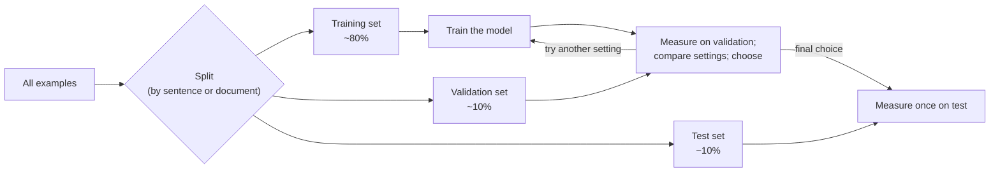

## Chapter 4: Data, Experiments, and Reproducibility

[Back to index](../../README.md) · Previous: [Chapter 3](ch03-tensors.md) · Next: [Chapter 5](ch05-neural-networks.md)

Every claim you make about a model is a claim about an experiment: "context size 4 works better", "this fine-tune improved accuracy", "the new prompt reduces errors". Machine learning makes it unusually easy to fool yourself. The model may have seen the test answers during training. A lucky random split may flatter one setting. Two runs you are comparing may differ in ways you forgot. This chapter is about the discipline that keeps results honest: how data is divided, how evaluation data leaks, what overfitting looks like when you measure it, and how to record runs so that you, or anyone else, can repeat them.

You will measure all of it on the counting model from Chapter 1, because its behavior is easy to inspect. Every idea here carries over unchanged to neural networks.

#### Learning outcomes

By the end of this chapter you will be able to:

1. Describe a dataset in terms of examples, inputs, and labels, and identify them for a language model.
2. Explain why data is split into training, validation, and test sets, and what each one is for.
3. Recognize common forms of leakage, and measure leakage caused by duplicate data.
4. Identify overfitting and underfitting from training and validation measurements.
5. Make runs reproducible with seeds, and name sources of nondeterminism that seeds do not control.
6. Record every run with its configuration, environment, data fingerprint, and results, and compare two runs.
7. Tell how much of a difference between two results could come from the split alone.

#### Prerequisites

- [Chapter 1](ch01-what-a-language-model-predicts.md): the counting model, and memorization (section 1.11).
- [Chapter 2](ch02-python-foundations-and-environment.md): the configuration system (section 2.9), JSON records, pytest.
- [Chapter 3](ch03-tensors.md) is not needed for the code here, but `set_seed` seeds PyTorch too, so the environment from Chapter 2 must be active.

#### New terms in this chapter

| Term | Plain-English meaning | Section |
|---|---|---|
| Dataset | A collection of examples used to train or evaluate a model | 4.2 |
| Example | One item in a dataset: an input and, usually, the desired output | 4.2 |
| Input / label (target) | What the model receives / what it should produce | 4.2 |
| Training set | Examples the model learns from | 4.3 |
| Validation set | Held-out examples used to compare settings and make decisions during development | 4.3 |
| Test set | Held-out examples used once, at the end, to estimate real-world performance | 4.3 |
| Generalization | Performing well on examples not seen in training | 4.3 |
| Leakage | Information from evaluation data reaching the training process, inflating results | 4.4 |
| Overfitting / underfitting | Fitting the training data's specifics instead of its general patterns / failing to capture even the general patterns | 4.5 |
| Accuracy, coverage | Share of positions predicted correctly / share whose context was seen in training | 4.5 |
| Random seed | A starting value that fixes the sequence of "random" numbers a generator produces | 4.6 |
| Nondeterminism | Variation between runs that the program's inputs do not control | 4.6 |
| Experiment record | Saved configuration, environment, data fingerprint, results, and log of one run | 4.8 |
| Hash (fingerprint) | A short value computed from data that changes if the data changes at all | 4.4, 4.8 |

---

### 4.1 The problem: a result you cannot reproduce is a result you cannot trust

Suppose you train the counting model with context size 4 and measure 72% accuracy. A week later you try context size 6 and measure 75%. Is 6 better?

You cannot tell yet. Any of the following could explain the difference:

- The 75% was measured on the training text. The model has seen those sentences; of course it predicts them well.
- The evaluation sentences also appeared in the training data, so the larger context memorized more of them.
- The two runs used different random splits, and one split happened to be easier.
- You edited the data file in between, or the code, or upgraded a library.
- The difference is real.

Professional practice exists to rule out everything except the last line. That takes three things, each covered in this chapter: **held-out data** that the model has never seen (4.3), **checks for leakage** between training and evaluation data (4.4), and **records** that let you see exactly what differed between two runs (4.6–4.8).

---

### 4.2 Datasets, examples, inputs, and labels

A **dataset** is a collection of **examples**. Each example has an **input** (what the model receives) and, in most tasks, a **label** or **target** (what the model should produce for that input).

| Task | Input | Label |
|---|---|---|
| Spam filtering | An email | `spam` or `not spam` |
| Next-word prediction (Chapter 1) | The previous words | The next word |
| Translation | A sentence in one language | The sentence in another |
| Question answering over documents (Chapter 33) | A question plus documents | The answer |

Language modeling has a convenient property: the labels come free with the text. Every position in every sentence is an example whose input is the text before that position and whose label is the token at that position. You saw this in Chapter 1's training loop, which turned each sentence into one observation per token. Training a model whose labels come from the data itself, with no human labeling, is called *self-supervised* learning. It is why language models can be trained on enormous amounts of text: nobody has to label it.

Two consequences matter for this chapter:

- **The unit of splitting is not the unit of prediction.** We predict words, but we split whole *sentences* (or, at larger scale, whole documents) between training and evaluation. Splitting individual positions would put the first half of a sentence in training and its second half in validation, and the model would have seen the context it is evaluated on.
- **Duplicates matter.** If the same sentence appears twice in the data, its two copies are separate examples that can land in different splits. Section 4.4 measures what that does.

#### A larger dataset for this chapter

Chapter 1's 40 sentences are too few to measure anything reliably. The script [`ch04_make_harbor_corpus.py`](../../code/scripts/ch04_make_harbor_corpus.py) generates a larger corpus by combining actors, actions, and times from fixed lists:

```python
@@FILE code/scripts/ch04_make_harbor_corpus.py@@
```

```bash
python -m scripts.ch04_make_harbor_corpus
```

Observed output:

```text
@@RUN python -m scripts.ch04_make_harbor_corpus@@
```

The generated file [`code/data/tiny/harbor_synth.txt`](../../code/data/tiny/harbor_synth.txt) is part of the repository, and the generator is deterministic, so everyone has the same data. Note the second number: 3,000 sentences but only 1,024 distinct ones. Because sentences are drawn at random from a limited set of combinations, about two thirds are repeats. That is a deliberate exaggeration of something real: text collected from the web is full of duplicates (copied articles, boilerplate, templates, quoted passages), which Chapter 18 deals with at scale.

> **Teaching simplification.** This corpus is generated from templates, so it is far more regular than real text, and the patterns a model can learn from it are limited. It is a laboratory for measuring splitting and overfitting, not a realistic training set. Part 4 uses a real, licensed dataset.

---

### 4.3 Training, validation, and test splits, and why there are three

A model's performance on the examples it was trained on tells you almost nothing about how it will perform on new ones. The counting model with a long context can reproduce its training sentences nearly perfectly (Chapter 1.11), but that is memory, not skill. What you want is **generalization**: good performance on examples the model has not seen. To measure it, you hold some examples back.

Data is usually divided into three parts:

- The **training set** is what the model learns from. For the counting model, the counts come only from these sentences.
- The **validation set** (also called the development or "dev" set) is held out from training and used *during development* to compare settings: which context size, which learning rate, which data cleaning. Every time you look at validation results and make a choice, a little information about the validation set flows into your decisions.
- The **test set** is held out from everything and used **once**, at the end, to estimate how the final choice will perform on new data. It is only trustworthy if nothing was decided by looking at it.

Why not only two? Because choosing among many settings by their validation score is itself a kind of fitting. If you try fifty configurations and keep the best on validation, part of its advantage is luck on that particular validation set. The test set, untouched by those choices, gives an unbiased final estimate. In this book's scripts, test evaluation is off by default (`evaluate_test = false`) so that you must turn it on deliberately.



Typical proportions are around 80/10/10 for small datasets. With very large datasets, the validation and test sets need not grow in proportion: a few thousand examples is often enough to measure with useful precision, and the rest can go to training. Section 4.9 shows how to check how much your measurement varies.

#### Two ways to split

File: [`code/llmfp/splits.py`](../../code/llmfp/splits.py)

```python
@@FILE code/llmfp/splits.py@@
```

**`shuffle_split`** copies the list, shuffles it with a generator seeded by `seed`, and cuts it at the requested fractions. The same seed gives the same split. It is simple, and it has two weaknesses: identical items can land in different splits, and adding one item to the dataset reshuffles everything, so yesterday's validation set and today's share almost nothing.

**`hash_split`** decides each item's split from a fingerprint of the item itself. A **hash** function turns any text into a fixed-size value that looks random but is completely determined by the text; change one character and the value changes unpredictably. SHA-256 is a standard, well-tested hash function. `stable_fraction` turns the first 8 bytes of the SHA-256 hash into a number between 0 and 1, and `hash_split` puts the item in training if the number is below 0.8, in validation if it is below 0.9, and in test otherwise. Consequences:

- **Identical items always land in the same split**, because they have identical hashes. Duplicates cannot leak across splits.
- **The assignment is stable as data grows.** Adding new sentences does not move old ones; the test `test_hash_split_is_stable_when_data_grows` checks this.
- **The `key` parameter controls what "identical" means.** Splitting by `key=lambda line: line.lower()` would also group sentences that differ only in capitalization. Splitting by an author, a website, or a document ID keeps all items from one source together, which matters when items from the same source resemble each other (Exercise 5).
- The sizes are only approximately the requested fractions, because each item's position is effectively random.
- `salt` plays the role of a seed: a different salt gives a different but equally stable assignment.

Why not use Python's built-in `hash()`? Because, as section 4.6 shows, Python deliberately gives strings a different hash in every new process. A split based on it would change every time the program ran.

---

### 4.4 Leakage: how evaluation data sneaks into training

**Leakage** is any path by which information from evaluation data reaches the training process. It makes results look better than they will be on genuinely new data, and it usually raises no error at all.

#### Measuring leakage from duplicates

The evaluation script trains one counting model per context size on the training split and measures it on both the training and validation splits. It uses a new module that computes three numbers for a model on a set of sentences:

File: [`code/llmfp/counting_eval.py`](../../code/llmfp/counting_eval.py)

```python
@@FILE code/llmfp/counting_eval.py@@
```

For every position, the module looks up the model's top-ranked next word, using the same ranking and tie-breaking as Chapter 1, and compares it with the actual next word. **Accuracy** is the share of positions where they match. **Coverage** is the share of positions whose context appeared in training at all; a position with an unseen context counts as wrong, because the model produces nothing. These are plain counts turned into shares.

First, a **leaky** setup: shuffle the raw data, duplicates included, and split it.

```bash
python -m scripts.ch04_evaluate_counting --set split=shuffle --set deduplicate=false
```

Observed output:

```text
@@RUN python -m scripts.ch04_evaluate_counting --set split=shuffle --set deduplicate=false@@
```

Then an **honest** setup: remove exact duplicates first, then split by hash (the default configuration).

```bash
python -m scripts.ch04_evaluate_counting
```

Observed output:

```text
@@RUN python -m scripts.ch04_evaluate_counting@@
```

Read the third line of each. In the leaky run, the large majority of validation sentences also appear, word for word, in the training set. Look at the validation accuracy at context size 10: the leaky setup reports about two thirds of positions correct, and the honest setup reports well under half. Same model, same code, same raw data. The only difference is whether validation sentences were also training sentences. The leaky number is not an estimate of how the model performs on new text; it is largely a measure of memorization.

At small context sizes, the two setups agree closely. A one-word context sees so much varied text that seeing the exact sentence before hardly helps. The more specific the model's memory, the more leakage inflates its scores. That pattern holds well beyond counting models: large neural networks can memorize, and memorized evaluation data (called **contamination** when it happens to public benchmarks, Chapters 18.6 and 37.4) is one of the main reasons published scores can overstate real performance.

#### Other forms of leakage

Duplicates are only one route. Others you will meet:

| Leak | How it happens | Defense |
|---|---|---|
| Duplicates and near-duplicates across splits | Copied or templated text | Deduplicate before splitting; split by hash (exact) and near-duplicate detection (Ch 18.5) |
| Related items in different splits | Sentences from the same document, messages from the same user, frames of the same video | Split by a group key (document, user, source) |
| Splitting after preprocessing that used all data | A vocabulary or normalization statistics computed on the full dataset | Fit every preprocessing step on training data only |
| Repeated peeking at the test set | Choosing settings by test score | Use validation for decisions; test once |
| Time travel | Training on data from after the period being predicted | Split by time when the task is about the future |
| Benchmark contamination | A public test set ended up in web-scraped training text | Check overlap; prefer private, freshly written evaluation sets (Ch 37) |

> **Suspiciously good results deserve suspicion first.** When a validation score jumps unexpectedly, the first hypothesis to rule out is leakage or a bug, not a breakthrough. Chapter 20.6 returns to this as a debugging rule.

---

### 4.5 Overfitting and underfitting, observed with the counting model

Look again at the honest run's table, this time comparing the **train acc** column with the **val acc** column as context size grows.

- At context size 1, training and validation accuracy are about the same, and both are fairly low. The model is too simple to capture the patterns in the data: it knows only which word tends to follow one word. This is **underfitting**: poor performance even on the data it learned from, because the model cannot represent what matters.
- At context sizes 2 to 4, both numbers rise. Longer contexts capture real patterns ("the harbor master" is followed by different words than "the keeper") and those patterns hold in new sentences too.
- From about context size 6, training accuracy keeps creeping up while validation accuracy falls, and validation coverage drops: more and more held-out contexts were never seen in training. The model is fitting *specific sentences* rather than *general patterns*. This is **overfitting**: the gap between training and validation performance grows, and validation performance gets worse.

The setting that generalizes best here is somewhere around context size 4, the peak of validation accuracy. That choice was made with the validation set, as it should be. The test set would then be consulted once, to report how that choice performs on unseen data:

```bash
python -m scripts.ch04_evaluate_counting --set evaluate_test=true --set "context_sizes=[4]"
```

```text
@@RUN python -m scripts.ch04_evaluate_counting --set evaluate_test=true --set "context_sizes=[4]"@@
```

(The quotes around `context_sizes=[4]` stop the shell from treating the square brackets specially, as with `".[dev]"` in Chapter 2.)

Two more observations from the table:

- **Training accuracy never approaches 100%.** In this corpus, the same context is genuinely followed by different words: "the keeper" might light the lamp or ring the bell, chosen at random by the generator. No model can predict a coin flip. Real text has the same property on a much larger scale, which is why the loss of a well-trained language model (Chapter 19.3) never reaches zero.
- **More parameters did not mean better generalization.** The context-size-10 model stores far more counts than the size-4 model and generalizes worse. Chapter 1 made the same point; now it is measured.

> **Overfitting in neural networks.** A neural network's training loss usually keeps falling as training continues, while its validation loss falls, flattens, and eventually rises. The same diagnosis applies: watch the gap between training and validation measurements (Chapter 19.4). The cures differ (more data, regularization, earlier stopping), and Part 4 covers them.

---

### 4.6 Random seeds and sources of nondeterminism

Machine-learning programs use randomness everywhere: shuffling data, initializing parameters (Chapter 5), sampling text (Chapter 1), dropping out units during training (Chapter 15). Computers produce this randomness with *pseudo-random number generators*: algorithms that produce a sequence of numbers that looks random but is entirely determined by a starting value, the **seed**. Same seed, same sequence.

The book's `set_seed` seeds the three generators its code uses: Python's `random`, NumPy's, and PyTorch's.

File: [`code/examples/ch04/seeds.py`](../../code/examples/ch04/seeds.py)

```python
@@FILE code/examples/ch04/seeds.py@@
```

Observed output:

```text
@@RUN python examples/ch04/seeds.py@@
```

What a seed does **not** do:

- **It does not fix results if the sequence of draws changes.** One extra draw (say, a new layer whose parameters are initialized first) shifts every later number. Two runs "with the same seed" but different code can differ completely. Record the code version along with the seed.
- **It does not seed generators you did not seed.** Each library has its own generator.
- **It does not make every operation deterministic.** Some GPU operations produce slightly different results from run to run even with identical seeds, because the order in which thousands of parallel additions happen varies, and floating-point addition gives slightly different results in different orders (section 3.4). PyTorch offers `torch.use_deterministic_algorithms(True)` to request deterministic versions, at some cost in speed, and raises an error for operations that have none. The book's CPU path does not need it; the setting is noted here for GPU users and was not exercised by the author.

#### A hidden source: the order of sets

File: [`code/examples/ch04/hash_order.py`](../../code/examples/ch04/hash_order.py)

```python
@@FILE code/examples/ch04/hash_order.py@@
```

Observed output (the first three lines will differ every time you run it):

```text
@@RUN python examples/ch04/hash_order.py@@
```

For security reasons, Python randomizes the hash of strings in every new process, which changes the iteration order of sets and of dictionaries built from sets. Code such as `vocabulary = list(set(words))` therefore produces a different order, and so different token IDs, on every run, and no seed you set inside the program affects it. The environment variable `PYTHONHASHSEED` fixes it, but the robust solution is in the last line: **sort** anything whose order matters. Chapter 1's tie-breaking rule and the book's vocabulary code (Chapter 7) do exactly this.

#### Sources of nondeterminism, summarized

| Source | Controlled by | Book's approach |
|---|---|---|
| Python, NumPy, PyTorch random draws | Seeds | `set_seed(config.seed)` at the start of every run |
| Set and dict-of-set ordering of strings | `PYTHONHASHSEED`, or sorting | Sort whenever order matters |
| Data file contents | Fingerprints | Record SHA-256 of every data file (4.8) |
| Code and library versions | Version control, pins | Record git commit and package versions (4.8) |
| Parallel GPU arithmetic order | Deterministic algorithm settings | Accept small differences, or enable deterministic mode (GPU path) |
| Number of CPU threads | PyTorch thread settings | Recorded; usually affects speed, rarely results |

---

### 4.7 Configuration files and command-line overrides

Chapter 2.9 built the configuration system: defaults in a frozen dataclass, values from a TOML file, `--set` overrides, and validation. This chapter's evaluation script uses it unchanged, with two additions worth noting.

File: [`code/configs/counting-eval-cpu.toml`](../../code/configs/counting-eval-cpu.toml)

```toml
@@FILE code/configs/counting-eval-cpu.toml@@
```

- **Lists.** `fractions` and `context_sizes` are TOML lists, and overrides can set lists too: `--set "context_sizes=[4]"`. The type checker from Chapter 2 checks simple types only; lists are passed through. That is a recorded simplification (see the [editorial ledger](../00-planning/editorial-ledger.md)): the dataclass's own `__post_init__` can add checks where they matter, as `EvalConfig` does for `split`.
- **Decisions belong in the config.** Whether to deduplicate, how to split, and whether to evaluate on the test set are experimental choices, so they are configuration values, recorded with every run, rather than code edits that leave no trace.

---

### 4.8 Experiment records: run directories, metadata, environment capture

Chapter 2's training script wrote to the same files every time, so each run overwrote the last (section 2.11). From now on, every run gets its own directory and leaves a complete record.

File: [`code/llmfp/experiment.py`](../../code/llmfp/experiment.py)

```python
@@FILE code/llmfp/experiment.py@@
```

`start_run` creates `runs/<name>/<timestamp>/` and writes:

- **`config.json`**: the fully resolved configuration, after the file and all overrides.
- **`environment.json`**: Python and package versions, platform, PyTorch thread count and device availability, the exact command line, the start time, the **git commit** of the code, whether there were **uncommitted changes**, and a **SHA-256 fingerprint of every data file**. If someone edits the data or the code, the record shows it.
- **`log.txt`**: everything logged during the run, via a logging handler attached to the root logger.

`finish_run` writes **`metrics.json`** and detaches the log handler.

Here is the record from one run of the evaluation script (the most recent one at this point: the test-set run from section 4.5):

```bash
ls runs/ch04-counting-eval/
cat runs/ch04-counting-eval/<run>/environment.json
```

```json
@@RUN cat "$(ls -d runs/ch04-counting-eval/*/ | tail -1)environment.json"@@
```

The `git_uncommitted_changes` field is `true` here because the author's working copy had uncommitted edits while the chapter was being built. For a result you intend to report, commit first, so that the recorded commit identifies the exact code.

#### Checking that a run reproduces

The real test of a record is whether it lets you repeat a run and get the same result. Run the default configuration twice, then compare the two most recent runs with the comparison tool from Exercise 4:

```bash
python -m scripts.ch04_evaluate_counting
python -m scripts.ch04_evaluate_counting
python -m solutions.ch04_compare_runs --latest runs/ch04-counting-eval
```

Observed output of the comparison:

```text
@@RUN python -m scripts.ch04_evaluate_counting > /dev/null && python -m scripts.ch04_evaluate_counting > /dev/null && python -m solutions.ch04_compare_runs --latest runs/ch04-counting-eval@@
```

Zero differences in configuration, environment (apart from the start time and command line, which the tool ignores), and metrics: the run reproduces exactly. Now change one thing, the seed, which here acts as the hash salt and so changes which sentences land in which split:

```bash
python -m scripts.ch04_evaluate_counting --set seed=1
python -m solutions.ch04_compare_runs --latest runs/ch04-counting-eval
```

```text
@@RUN python -m scripts.ch04_evaluate_counting --set seed=1 > /dev/null && python -m solutions.ch04_compare_runs --latest runs/ch04-counting-eval --limit 6@@
```

The configuration difference is exactly the one you made, and every metric moved. How much should a different split move the results? That is the subject of the next section.

---

### 4.9 Milestone: how much of a difference is real?

You now have the counting model evaluated honestly, with leakage measured, overfitting observed, and runs recorded. One question remains before you can compare two settings with confidence: how much would the result change if nothing changed except *which* sentences ended up in validation?

The solution to Exercise 3 answers it by re-running the honest evaluation with ten different salts, for one context size:

```bash
python -m solutions.ch04_seed_spread
```

Observed output:

```text
@@RUN python -m solutions.ch04_seed_spread@@
```

Validation accuracy varies by several percentage points across splits, with the model and code unchanged. A difference between two settings smaller than this spread could be luck of the split. The leakage effect in section 4.4, more than twenty percentage points at context size 10, is far larger than this spread; the improvement from context size 1 to 4 is too. Those are real. A one-point "improvement" from a new setting is not distinguishable from noise with a validation set this small.

This is a practical, measured way to judge differences without statistics formulas: **repeat the measurement with the things you do not care about varied (splits, seeds), and see whether the difference you care about is larger than the variation**. Chapter 37.7 develops it further for LLM evaluation, where evaluation sets are often small and the temptation to over-read small differences is strong.

---

### 4.10 Common mistakes, recap, concept checks, exercises, answers, and checkpoint

#### Common mistakes

| Symptom | Likely cause | Fix |
|---|---|---|
| Validation results far better than results on genuinely new data | Leakage: duplicates or related items across splits | Deduplicate; split by hash or group key; measure overlap |
| Results change every run despite a fixed seed | An unseeded generator, set ordering, or different code paths drawing different numbers | `set_seed` at start; sort when order matters; record code version |
| Validation set changed after adding data | Shuffle-based split | Hash-based split |
| Test score reported after many decisions based on it | Test set used as a validation set | Decide with validation; test once |
| Two runs differ and nobody knows why | No records | `start_run` / `finish_run`; compare records |
| Training accuracy much higher than validation accuracy, and the gap grows | Overfitting | Simpler model, more data, or earlier stopping (Part 4) |
| Training and validation both low | Underfitting | A model that can capture more (Chapters 5–7) |
| A record's commit does not match the code that ran | Uncommitted changes | Commit before runs you intend to report; check `git_uncommitted_changes` |

#### Recap

- A dataset is made of examples with inputs and labels; for language models, labels come from the text itself.
- Split by the right unit (sentences or documents, not positions) into training, validation, and test sets. Train on the first, decide with the second, report the third once.
- Leakage silently inflates results. Duplicates are a major source; deduplication and hash-based splits prevent it, and measuring overlap detects it.
- Underfitting shows as low training and validation performance; overfitting shows as a growing gap between them, with validation performance falling.
- Seeds fix the sequence of random draws, not the code that consumes them. Set iteration order, GPU arithmetic, and file contents are further sources of variation.
- Every run should leave a record: configuration, environment, code version, data fingerprints, metrics, and log. Compare records to see exactly what changed.
- Judge whether a difference is real by comparing it with the variation you get from changing only irrelevant things.

#### Concept checks

1. For next-word prediction, what are the input and the label of one example? Why is no human labeling needed?
2. Why should you split by sentence or document rather than by individual position?
3. What would go wrong if you chose the context size by looking at test-set accuracy?
4. In section 4.4, why does leakage barely affect context size 1 but strongly affect context size 10?
5. Name two forms of leakage that deduplication does not prevent.
6. Why is `hash_split` stable when the dataset grows, while `shuffle_split` is not?
7. Why can't `hash()` replace SHA-256 in `stable_fraction`?
8. What pattern in training and validation accuracy indicates overfitting? What indicates underfitting?
9. Why does training accuracy on the synthetic corpus stay well below 100% even for long contexts?
10. You set the same seed in two runs but get different results. Give three possible reasons.
11. What does recording a SHA-256 fingerprint of the data file protect against?
12. Two settings differ by 1.5 percentage points of validation accuracy. What would you do before concluding that one is better?

#### Exercises

**Exercise 1 (spot the leak).** For each scenario, say whether there is leakage and how you would fix it: (a) a spam dataset where the same promotional email was sent to thousands of users, split randomly by email; (b) a vocabulary built from all text before splitting, used only to map words to IDs; (c) a model that predicts tomorrow's harbor traffic, trained on randomly shuffled days from the last five years; (d) customer-support conversations split by message rather than by conversation.

**Exercise 2 (a group split).** Use `hash_split` with a `key` that returns the sentence's *actor* (its first two words, such as "the keeper", or the words after the time phrase when the sentence starts with one). How does validation accuracy change compared with the default split, and why? What kind of generalization does this split measure?

**Exercise 3 (how noisy is the validation set?).** Re-run the honest evaluation with ten different salts for context sizes 4 and 8, and report the lowest, highest, and middle validation accuracy for each. Is the drop from context size 4 to 8 larger than the variation?

**Exercise 4 (compare two runs).** Write a script that takes two run directories and prints every difference between their `config.json`, `environment.json` (ignoring the start time and command line), and `metrics.json` files. Use it to show that two runs of the default configuration are identical.

**Exercise 5 (record a note).** Add an optional `note` string to `EvalConfig` (default empty), and make the script print it at the start. Use it to label a run ("testing salt 7"). Why is it better to keep notes in the configuration than in a separate notebook?

**Exercise 6 (break reproducibility on purpose).** In a copy of the evaluation script, build the training sentences with `list(set(splits.train))` instead of `splits.train`, train, and print the first ten entries of `model.vocabulary()` in insertion order, using `list(dict.fromkeys(...))` to preserve the order counts were added. Run it twice. What changes between runs, and does it affect the accuracy? Then fix it.

#### Suggested answers and acceptance criteria

**Concept checks**

1. Input: the words before a position; label: the word at that position. The text itself supplies the labels, so the learning is self-supervised.
2. Splitting positions puts parts of the same sentence in training and evaluation, so the model has seen the context (and often the answer) it is evaluated on.
3. The test score would be partly the result of selecting whatever happened to score best on that specific test set, so it would overestimate performance on new data; and there would be no untouched data left for an honest final estimate.
4. A one-word context is shared by many different sentences, so having seen the exact sentence adds little. A ten-word context is nearly unique to its sentence, so having seen the sentence lets the model reproduce it.
5. Any two of: related but non-identical items across splits (same document or user); preprocessing fitted on all data; repeated test-set peeking; training on data from after the prediction period; benchmark contamination of near-duplicates.
6. Each item's split depends only on the item's own hash, so adding items does not move existing ones. A shuffle depends on the whole list, so any change reorders everything.
7. Python randomizes string hashes per process, so `hash()` gives a different value on every run, and the split would change each time.
8. Overfitting: training performance high and still rising, validation performance falling, gap growing. Underfitting: both low and close together.
9. The same context is followed by different words at random in the data, so no model can always be right. That remaining uncertainty is a property of the data.
10. Any three of: different code consuming random numbers in a different order; an unseeded generator; set or dictionary ordering of strings; different data file; different library versions; nondeterministic GPU operations.
11. Silent changes to the data. If the file changes at all, the fingerprint changes, so two runs with different data cannot be mistaken for comparable runs.
12. Measure the variation from irrelevant changes (other splits or seeds) and check whether 1.5 points is clearly larger; if not, collect more evaluation data or treat the settings as equivalent.

**Exercise 1.** (a) Leakage: copies of the same email land in both splits. Deduplicate, or split by a hash of the email body. (b) A vocabulary built only for ID mapping leaks little in practice, but it does tell the system which words exist in evaluation data; strictly, build it from training data. For statistics that affect predictions (such as normalization values), fitting on all data is real leakage. (c) Leakage through time: the model learns from days after the ones it is evaluated on. Split by date: train on earlier periods, validate and test on later ones. (d) Messages from one conversation are strongly related; split by conversation ID. Acceptance: each answer names the information path and a concrete fix.

**Exercise 2.** One possible key: strip a leading time phrase if present, then take the first two words, lowercased. Acceptance: you report the new validation accuracy and explain it. In the author's run (salt `"0"`, with "the harbor master" kept as one three-word actor), the six actors split so that "the children" and "the gulls" appeared only in validation, and validation accuracy fell from 63.4%, 67.4%, and 48.9% (context sizes 2, 4, 8, default split) to 26.6%, 16.7%, and 10.1%, with coverage dropping to between a fifth and a half. Entire actors, and the actions only they perform, are missing from training, so most validation contexts were never seen. With only six groups, which groups land in validation also makes the result very sensitive to the salt. This measures generalization to *new kinds of sentences*, a harder and often more realistic test than generalization to new combinations of familiar ones. Which split is right depends on what the deployed model will face.

**Exercise 3.** Solution: [`code/solutions/ch04_seed_spread.py`](../../code/solutions/ch04_seed_spread.py). The author's observed summary lines:

```text
@@RUN python -m solutions.ch04_seed_spread | tail -1 && python -m solutions.ch04_seed_spread --context-size 8 | tail -1@@
```

Acceptance: the ranges for context sizes 4 and 8 do not overlap, so the drop is larger than the split-to-split variation and can be called real for this dataset.

**Exercise 4.** Solution: [`code/solutions/ch04_compare_runs.py`](../../code/solutions/ch04_compare_runs.py), demonstrated in section 4.8. The useful idea is `flatten`, which turns nested dictionaries and lists into dotted keys so two records can be compared key by key. Acceptance: two default runs show zero differences; a run with one override shows exactly that difference in the configuration.

**Exercise 5.** Add `note: str = ""` to `EvalConfig` and `print(f"Note: {config.note}")` when it is non-empty. Run with `--set "note=testing salt 7"`. Acceptance: the note appears in the printed output and in the run's `config.json`. A note in the configuration travels with the run's results automatically, so it cannot be lost or attached to the wrong run.

**Exercise 6.** Acceptance: you observe that the order of entries in the vocabulary differs between runs (because the training sentences are visited in a different order), while the accuracy stays the same, because counting does not depend on order. Note the danger: the counting model happens to be insensitive to order, but anything that assigns IDs by first appearance, or a neural network trained on examples in a different order, would not be. The fix is to keep the original list, or `sorted(set(...))`, wherever a set was used for deduplication.

#### Checkpoint: what you can now do independently

You can now:

- Split data by the right unit into training, validation, and test sets, with a method that resists duplicate leakage and stays stable as data grows.
- Detect and measure leakage, and list the other routes by which it occurs.
- Diagnose underfitting and overfitting from training and validation measurements.
- Make runs reproducible, and explain which sources of variation seeds do not control.
- Record every run with configuration, environment, code version, data fingerprints, metrics, and logs, and compare two runs precisely.
- Judge whether a measured difference is larger than the variation caused by irrelevant changes.

**Next:** [Chapter 5](ch05-neural-networks.md) replaces the count table with a neural network: an adjustable function that can produce scores for contexts it has never seen.
